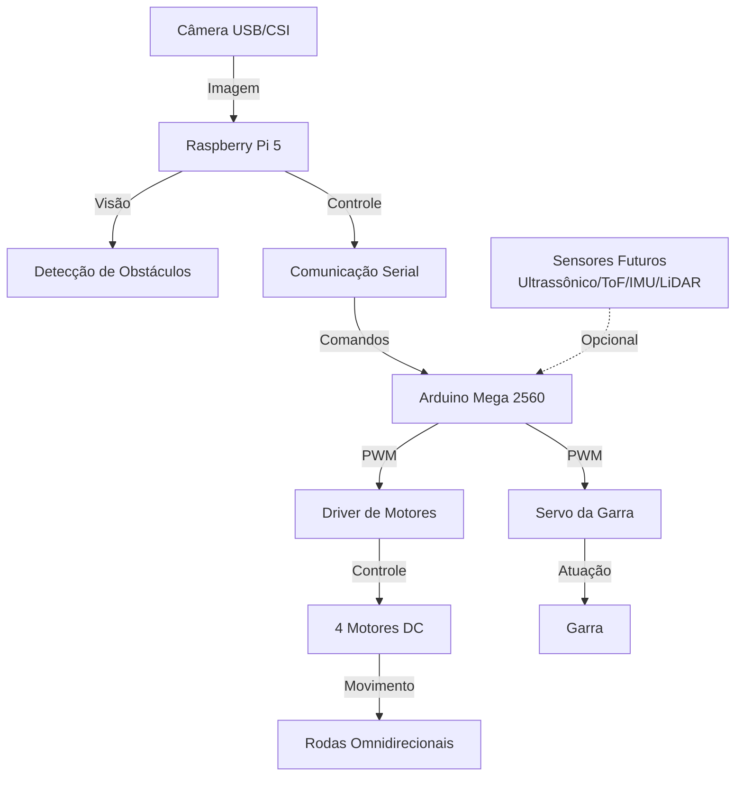
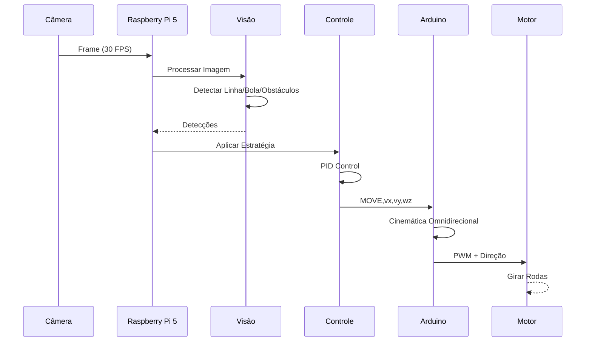

# Guia de Montagem Física - Robô OBR 2026

Este documento descreve, de forma passo a passo e com alto nível de detalhe, como montar fisicamente o robô usando:

- 2 pontes H TB6612FNG;
- 1 ponte H A para os motores da esquerda;
- 1 ponte H B para os motores da direita;
- 4 motores omnidirecionais;
- 1 servo motor para a garra;
- 1 sensor ultrassônico HC-SR04 (opcional, mas integrado no firmware);
- 1 Arduino Mega 2560 (o firmware atual foi escrito para este modelo);
- 1 Raspberry Pi.

O objetivo é que qualquer pessoa da equipe consiga montar, conectar, testar e diagnosticar o sistema sem depender de conhecimento tácito.

---

### Mapeamento de pinos do firmware atual (Arduino Mega 2560)

O sketch em [arduino/firmware/robot_mega/robot_mega.ino](arduino/firmware/robot_mega/robot_mega.ino) usa os seguintes pinos para o robô:

- Motor 4: enable em D2, IN1 em D22, IN2 em D23
- Motor 2: enable em D3, IN1 em D24, IN2 em D25
- Motor 3: enable em D4, IN1 em D26, IN2 em D27
- Motor 1: enable em D5, IN1 em D28 (A4), IN2 em D29 (A5)
- Servo da garra: pino D44
- Sensor ultrassônico: TRIG em A2, ECHO em A3

> O firmware atual não usa um pino STBY dedicado; o controle é feito pelos pinos de enable e direção. Não existe um pino do Mega reservado para STBY neste firmware, e a documentação abaixo segue esse mapeamento real.

### Resumo exato das conexões no Arduino Mega

| Componente | Pino no Arduino Mega | Função |
|---|---|---|
| Ponte H A — canal A enable/PWM | D2 | PWM do motor esquerdo frontal |
| Ponte H A — canal A IN1 | D22 | direção do motor esquerdo frontal |
| Ponte H A — canal A IN2 | D23 | direção do motor esquerdo frontal |
| Ponte H A — canal B enable/PWM | D3 | PWM do motor esquerdo traseiro |
| Ponte H A — canal B IN1 | D24 | direção do motor esquerdo traseiro |
| Ponte H A — canal B IN2 | D25 | direção do motor esquerdo traseiro |
| Ponte H B — canal A enable/PWM | D4 | PWM do motor direito frontal |
| Ponte H B — canal A IN1 | D26 | direção do motor direito frontal |
| Ponte H B — canal A IN2 | D27 | direção do motor direito frontal |
| Ponte H B — canal B enable/PWM | D5 | PWM do motor direito traseiro |
| Ponte H B — canal B IN1 | D28 (A4) | direção do motor direito traseiro |
| Ponte H B — canal B IN2 | D29 (A5) | direção do motor direito traseiro |
| Servo da garra | D44 | sinal de controle |
| Sensor ultrassônico TRIG | A2 | disparo |
| Sensor ultrassônico ECHO | A3 | eco |

## 1. Lista de componentes

### Controle e processamento

- 1 Raspberry Pi 5 (ou 4)
- 1 Arduino Mega 2560
- 2 módulos TB6612FNG
- 1 servo motor da garra
- 1 sensor ultrassônico HC-SR04
- 4 motores DC com redução
- 4 rodas omnidirecionais
- 1 bateria ou fonte para motores
- 1 fonte/USB para o Raspberry Pi e Arduino
- fios jumper macho-macho e macho-fêmea
- conectores ou terminal blocks
- capacitores de desacoplamento (100 nF + 100 µF recomendados)

### Ferramentas recomendadas

- chave de fenda pequena
- alicate de corte
- multímetro
- fita isolante ou tubo termorretrátil
- etiqueta ou marcador para identificar fios

---

## 2. Estrutura física recomendada

Monte o robô na seguinte ordem:

1. Fixar a estrutura base e as rodas omnidirecionais.
2. Fixar os quatro motores nas posições corretas.
3. Posicionar o Arduino em uma região acessível, longe de vibração excessiva.
4. Posicionar as duas pontes H em uma área seca e próxima aos motores.
5. Montar o servo da garra na frente da base.
6. Posicionar o sensor ultrassônico na frente do robô, com boa visibilidade.
7. Organizar os cabos por caminho claro e seguro.

> A organização do cabeamento é essencial para evitar curto, ruído e falhas de comunicação.

---

## 3. Posicionamento dos motores

Identifique os quatro motores como:

- FL: frente esquerda
- FR: frente direita
- RL: trás esquerda
- RR: trás direita

Cada motor deve ficar fixo na estrutura e conectado a uma roda omnidirecional.

### Convenção recomendada de montagem

| Identificação | Posição física |
|---|---|
| FL | Canto dianteiro esquerdo |
| FR | Canto dianteiro direito |
| RL | Canto traseiro esquerdo |
| RR | Canto traseiro direito |

A ordem de conexão elétrica não precisa seguir a ordem física do chassi, mas é importante manter a mesma convenção no firmware.

---

## 4. Montagem da primeira ponte H (TB6612FNG A)

A ponte H A controla os motores da esquerda: FL e RL.

### Pinos da ponte A

| Pino da ponte H | Função | Conexão exata no Arduino Mega |
|---|---|---|
| VM | alimentação dos motores | sem conexão direta ao Mega; ligar à bateria/fonte |
| VCC | alimentação da lógica | 5 V do Mega |
| GND | terra comum | GND do Mega e GND da bateria |
| STBY | habilitação do driver | não usado pelo firmware atual; não há pino do Mega associado |
| PWMA | PWM do canal A | D2 |
| AIN1 | direção do canal A | D22 |
| AIN2 | direção do canal A | D23 |
| AO1 | saída do canal A | terminal do motor FL |
| AO2 | saída do canal A | terminal do motor FL |
| PWMB | PWM do canal B | D3 |
| BIN1 | direção do canal B | D24 |
| BIN2 | direção do canal B | D25 |
| BO1 | saída do canal B | terminal do motor RL |
| BO2 | saída do canal B | terminal do motor RL |

### Conexão física sugerida para a Ponte A

| Componente | Conexão |
|---|---|
| VM da Ponte A | positivo da alimentação dos motores |
| VCC da Ponte A | 5 V do Mega |
| GND da Ponte A | GND do Mega e GND da bateria |
| Enable/ PWM do canal A | pino D2 do Mega |
| IN1 do canal A | pino D22 do Mega |
| IN2 do canal A | pino D23 do Mega |
| Enable/ PWM do canal B | pino D3 do Mega |
| IN1 do canal B | pino D24 do Mega |
| IN2 do canal B | pino D25 do Mega |
| AO1/AO2 | motor FL |
| BO1/BO2 | motor RL |

### Observação importante

Os pinos exatos podem ser alterados no firmware. O importante é manter a convenção no código.

---

## 5. Montagem da segunda ponte H (TB6612FNG B)

A ponte H B controla os motores da direita: FR e RR.

### Pinos da ponte B

| Pino da ponte H | Função | Conexão exata no Arduino Mega |
|---|---|---|
| VM | alimentação dos motores | sem conexão direta ao Mega; ligar à bateria/fonte |
| VCC | alimentação da lógica | 5 V do Mega |
| GND | terra comum | GND do Mega e GND da bateria |
| STBY | habilitação do driver | não usado pelo firmware atual; não há pino do Mega associado |
| PWMA | PWM do canal A | D4 |
| AIN1 | direção do canal A | D26 |
| AIN2 | direção do canal A | D27 |
| AO1 | saída do canal A | terminal do motor FR |
| AO2 | saída do canal A | terminal do motor FR |
| PWMB | PWM do canal B | D5 |
| BIN1 | direção do canal B | D28 (A4) |
| BIN2 | direção do canal B | D29 (A5) |
| BO1 | saída do canal B | terminal do motor RR |
| BO2 | saída do canal B | terminal do motor RR |

### Conexão física sugerida para a Ponte B

| Componente | Conexão |
|---|---|
| VM da Ponte B | mesmo positivo da alimentação dos motores |
| VCC da Ponte B | 5 V do Mega |
| GND da Ponte B | GND do Mega e GND da bateria |
| Enable/ PWM do canal A | pino D4 do Mega |
| IN1 do canal A | pino D26 do Mega |
| IN2 do canal A | pino D27 do Mega |
| Enable/ PWM do canal B | pino D5 do Mega |
| IN1 do canal B | pino D28 do Mega (A4) |
| IN2 do canal B | pino D29 do Mega (A5) |
| AO1/AO2 | motor FR |
| BO1/BO2 | motor RR |

### Atenção

Se quiser simplificar a montagem, pode-se usar o mesmo pino STBY para ambas as pontes, desde que a lógica do firmware fique consistente. O firmware atual usa um único conjunto de pinos para 4 motores em um único controlador abstraído, então a adaptação pode ser feita conforme o hardware real.

---

## 6. Ligação dos motores às ponte H

Cada motor deve ser ligado aos dois pinos de saída de um canal.

### Exemplo prático

| Motor | Ponte H | Pinos de saída |
|---|---|---|
| FL | Ponte A | AO1 e AO2 |
| RL | Ponte A | BO1 e BO2 |
| FR | Ponte B | AO1 e AO2 |
| RR | Ponte B | BO1 e BO2 |

### Passo a passo

1. Identifique os dois fios do motor.
2. Conecte um fio ao pino AO1 ou BO1.
3. Conecte o outro fio ao pino AO2 ou BO2.
4. Não importa qual fio vai em qual saída no início; se o motor girar invertido, isso será corrigido no firmware.

> Não é necessário inverter a fiação do motor no chassi. O sentido pode ser ajustado no firmware com um fator de sinal.

---

## 7. Ligação do sensor ultrassônico HC-SR04

O firmware do Arduino usa os pinos A2 e A3 para o sensor ultrassônico.

### Pinagem do HC-SR04

| Pino do sensor | Função | Conexão exata no Arduino Mega |
|---|---|---|
| VCC | 5 V | 5 V do Mega |
| TRIG | disparo | A2 |
| ECHO | eco | A3 |
| GND | terra | GND do Mega |

### Posicionamento físico

- Fixar na parte frontal do robô.
- Direcionar para a frente.
- Manter afastado de motores e cabos de potência para reduzir ruído.
- Evitar que a estrutura metálica ou a bateria interfira na leitura.

### Passo a passo

1. Conectar VCC do sensor ao 5 V do Arduino.
2. Conectar GND ao GND do Arduino.
3. Conectar TRIG ao pino A2.
4. Conectar ECHO ao pino A3.

---

## 8. Ligação do servo da garra

O firmware usa o pino D2 para o servo da garra.

### Pinagem típica do servo

| Pino do servo | Função | Conexão exata no Arduino Mega |
|---|---|---|
| VCC | alimentação | 5 V do Mega |
| GND | terra | GND do Mega |
| Sinal | controle PWM | D44 |

### Posicionamento físico

- Fixar o servo na estrutura da garra.
- Se possível, deixar o eixo do servo alinhado com a articulação da garra.
- Evitar sobrecarga mecânica no servo.

### Passo a passo

1. Conectar VCC ao 5 V do Arduino.
2. Conectar GND ao GND do Arduino.
3. Conectar o fio de sinal ao pino D2.

---

## 9. Ligação do Arduino com o Raspberry Pi

### Opção recomendada: USB

- conectar o Arduino ao Raspberry Pi por cabo USB.
- esta é a forma mais simples e robusta.

### Opção alternativa: UART

- usar TX/RX entre Arduino e Raspberry Pi.
- se usar UART, o Raspberry Pi deve trabalhar com 3.3 V e o Arduino com 5 V.
- em geral, a comunicação por USB é preferida para inicial teste.

### Conexão serial básica

| Componente | Conexão |
|---|---|
| Arduino TX | Raspberry RX |
| Arduino RX | Raspberry TX |
| GND comum | GND comum |

> Se usar UART, recomenda-se um divisor de tensão para o pino RX do Arduino.

---

## 10. Alimentação elétrica

### Alimentação dos motores

- A alimentação dos motores deve vir da bateria ou fonte de potência dedicada.
- Não alimentar os motores pelo pino 5 V do Arduino.
- O positivo da bateria deve ir para VM das pontes H.

### Alimentação da lógica

- O VCC de cada ponte H pode receber 5 V do Arduino.
- O Arduino pode ser alimentado por USB ou por fonte regulada.

### GND comum

- O GND da bateria, do Arduino, das pontes H, do servo e do sensor ultrassônico devem ser unidos.
- Sem GND comum, o sistema pode não responder corretamente.

### Capacidade recomendada da bateria

- Uma bateria com margem de corrente é recomendada.
- Para 4 motores pequenos/médios, prefira uma fonte estável que consiga entregar pico sem queda acentuada.

### Cuidados de alimentação

- use fios curtos e grossos para os motores;
- mantenha os cabos de potência longe dos cabos de sinal;
- coloque capacitores próximos às pontes H;
- monitore aquecimento.

---

## 11. Passo a passo de montagem

### Passo 1 — Preparar a base

- definir posições dos motores;
- fixar as rodas e a estrutura;
- deixar espaço para Arduino, pontes H e bateria.

### Passo 2 — Instalar os motores

- prender cada motor na base;
- acoplar a roda omnidirecional;
- verificar se há folga e se não há atrito excessivo.

### Passo 3 — Posicionar as pontes H

- montar a Ponte A perto dos motores FL/FR;
- montar a Ponte B perto dos motores RL/RR;
- fixar firmemente sem risco de curto.

### Passo 4 — Conectar os motores às pontes H

- conectar FL à Ponte A (AO1/AO2);
- conectar FR à Ponte A (BO1/BO2);
- conectar RL à Ponte B (AO1/AO2);
- conectar RR à Ponte B (BO1/BO2).

### Passo 5 — Conectar alimentação

- ligar o positivo da bateria em VM das duas pontes H;
- ligar o GND da bateria no GND das duas pontes H;
- ligar o GND da bateria no GND do Arduino;
- ligar 5 V do Arduino no VCC das duas pontes H.

**Se estiver usando Arduino Mega:**

- mantenha exatamente a mesma regra de GND comum entre Mega, Raspberry e
    pontes H;
- conecte `VCC` das pontes H ao `5V` do Mega (ou a um regulador 5V estável);
- para comunicação TTL dedicada, considere usar `Serial1` (pinos 18/19) e
    lembre-se do conversor de nível entre 5V e 3.3V.

### Passo 6 — Conectar sinais do Arduino

- ligar os sinais de direção e PWM da Ponte A aos pinos definidos no firmware;
- ligar os sinais de direção e PWM da Ponte B aos pinos definidos no firmware;
- ligar o STBY conforme a configuração escolhida.

### Passo 7 — Conectar servo da garra

- VCC no 5V;
- GND no GND;
- sinal no pino D44 do Mega.

### Passo 8 — Conectar sensor ultrassônico

- VCC no 5V;
- GND no GND;
- TRIG em A2;
- ECHO em A3.

### Passo 9 — Conectar Raspberry Pi

- via USB para simplificar e evitar problemas de tensão.

### Passo 10 — Teste inicial sem carga

- energizar o sistema;
- verificar se o Arduino inicializa;
- verificar se a comunicação serial funciona;
- testar cada motor individualmente com PWM baixo.

---

## 12. Testes de bancada

### Teste 1 — alimentação

- medir tensão em VM e VCC;
- confirmar se a bateria entrega tensão estável.

### Teste 2 — ponte H isolada

- testar um motor por vez;
- confirmar se a rotação sobe e desce com PWM.

### Teste 3 — sentido

- verificar se o sentido corresponde ao esperado;
- corrigir via firmware se necessário.

### Teste 4 — servo

- mandar abertura e fechamento simples;
- verificar se o movimento é suave.

### Teste 5 — sensor ultrassônico

- verificar se o sensor responde e a leitura aparece no serial.

---

## 13. Checklist final

- [ ] motores presos e alinhados
- [ ] rodas omnidirecionais fixadas
- [ ] pontes H montadas e fixadas
- [ ] motor FL conectado à Ponte A
- [ ] motor FR conectado à Ponte A
- [ ] motor RL conectado à Ponte B
- [ ] motor RR conectado à Ponte B
- [ ] alimentação de motores conectada corretamente
- [ ] alimentação da lógica conectada corretamente
- [ ] GND comum garantido
- [ ] servo da garra conectado
- [ ] sensor ultrassônico conectado
- [ ] Arduino ligado ao Raspberry Pi
- [ ] firmware compilado e testado

---

## 14. Observações importantes

- O sentido de cada motor pode ser ajustado no firmware, sem necessidade de rewire.
- Nunca alimentar motores diretamente pelo pino 5 V do Arduino.
- Se houver reinicialização do Arduino, conferir alimentação, GND e ruído.
- Se um motor não girar, verificar STBY, PWM, conexão do fio e tensão da bateria.


```
    ┌─────────────┐
 IN1├─────────────┤OUT1 (Motor 1+)
 IN2├─────────────┤OUT2 (Motor 1-)
 EN ├─────────────┤OUT3 (Motor 2+)
 IN3├─────────────┤OUT4 (Motor 2-)
 IN4├─────────────┤
 GND├─────────────┤GND
 +VS├─────────────┤+VS (Motor Supply)
    └─────────────┘
```

**Conexão com Arduino (para 1 driver controlando 2 motores):**

```
Arduino → L298N
D3 (PWM) → EN1 (Motor 1 velocidade)
D4 → IN1 (Motor 1 direção)
D5 → IN2 (Motor 1 direção)
D6 (PWM) → EN2 (Motor 2 velocidade)
D7 → IN3 (Motor 2 direção)
D8 → IN4 (Motor 2 direção)
GND → GND

Motor Supply: 5-6V
```

### DRV8835 (Alternativa Compacta)

**Especificações:**
- Tensão de entrada: 6.5V a 28V
- Corrente máxima: 1.5A por canal
- Mais compacto que L298N
- PWM integrado

**Pinagem e conexão similar ao L298N**

### Expansão para 4 Motores

Use 2 drivers L298N (um por par de motores):

```
Raspberry Pi
    ↓
Arduino
    ├─→ Controlador PWM/Digital
    │       ├─→ Driver 1 (Motores 1-2)
    │       └─→ Driver 2 (Motores 3-4)
    └─→ Alimentação Comum

Motor Supply: 5-6V/3A (compartilhado)
```

---

## Servo da Garra

### Servo SG90 (Padrão)

**Especificações:**
- Tensão: 5V
- Corrente: 0.5-1A em movimento
- Ângulo: 0-180°
- Torque: ~1.8 kgf·cm

**Pinagem:**
- Vermelho: 5V
- Marrom/Preto: GND
- Laranja/Amarelo: Sinal PWM

**Conexão com Arduino:**
```
Arduino D2 (PWM) → Servo Signal (Laranja/Amarelo)
Arduino 5V → Servo Power (Vermelho)
Arduino GND → Servo Ground (Marrom/Preto)
```

### Calibração do Servo

No `config.py`:
```python
kServoOpenAngle = 20    # Ângulo para abrir garra
kServoClosedAngle = 110 # Ângulo para fechar garra
```

Ajuste estes valores conforme necessário para o servo específico.

---

## Câmera

### Câmera CSI (Ribbon Cable) - Recomendada

**Vantagens:**
- Menor latência
- Menor consumo de energia
- Melhor integração com Raspberry Pi
- Drivers otimizados (Picamera2, libcamera)

**Instalação:**

1. Desligar o Raspberry Pi
2. Localizar o conector CSI (perto do conector HDMI)
3. Levantar a aba plástica do conector
4. Inserir o ribbon cable (lado azul/preto para a câmera)
5. Abaixar a aba plástica
6. Energizar e testar

**Compatibilidade de Ribbon Cable:**

| Tipo | Comprimento | Uso |
|------|------------|-----|
| 15-pin (mais comum) | Até 30cm | Câmera v2, v3 |
| 22-pin | Até 50cm | Câmera de alta resolução |

### Câmera USB

**Vantagens:**
- Plug-and-play
- Compatibilidade universal
- Pode usar cabo de extensão

**Instalação:**

1. Conectar a câmera em qualquer porta USB do Raspberry Pi
2. Verificar com `lsusb` no terminal
3. Usar backend OpenCV (cv2.VideoCapture)

**Desvantagens:**
- Maior latência
- Maior consumo de energia
- Requer driver no Raspberry (geralmente automático)

### Seleção de Backend no Software

No `config.py`:
```python
CAMERA_BACKEND = "auto"  # ou "picamera2", "libcamera", "rpicam", "opencv"
CAMERA_BACKEND_PREFERENCE = ("picamera2", "libcamera", "rpicam", "opencv")
```

**Prioridade de seleção:**
1. **picamera2**: Melhor para câmeras CSI em Raspberry Pi OS
2. **libcamera**: Backend de câmera moderno
3. **rpicam**: Alternativa em tempo real
4. **opencv**: Fallback universal (câmeras USB)

---

## Comunicação Serial

### Protocolo de keepalive e watchdog

- O Raspberry envia `HEARTBEAT` periodicamente como keepalive da ligação serial.
- O Arduino interpreta `HEARTBEAT` como sinal de vida e reseta o watchdog local sem executar movimento.
- Se não houver comandos válidos nem `HEARTBEAT` por mais de 1 segundo, o firmware para os motores e envia `WATCHDOG`.
- O Raspberry trata `WATCHDOG` como falha explícita de comunicação e entra em estado seguro enviando `STOP`.
- Após a recuperação do tráfego, o watchdog é limpo e o sistema volta ao fluxo normal.

### Modo USB (Padrão)

**Vantagens:**
- Simples (plug-and-play)
- Automático no Raspberry Pi
- Também programa o Arduino

**Como usar:**

1. Conectar Arduino ao Raspberry via USB
2. No `config.py`:
   ```python
   SERIAL_MODE = "usb"
   SERIAL_PORT = "auto"
   ```
3. O software encontra a porta automaticamente

**Portas típicas:**
- Linux: `/dev/ttyUSB0`, `/dev/ttyUSB1`, etc.
- Windows: `COM3`, `COM4`, etc.
- macOS: `/dev/tty.usbserial-*`

### Modo UART (GPIO)

**Vantagens:**
- Sem cabos extras
- Dedicado (não compartilha com USB)
- Menor latência

**Como usar:**

1. **Desabilitar console serial no Raspberry Pi:**
   ```bash
   sudo raspi-config
   # Interface Options → Serial Port → Disable
   # Serial Port Login → Disable
   ```

2. **Conectar fisicamente:**
   - Raspberry GPIO 14 (TX) → Arduino D0 (RX) [com divisor 3.3V→5V]
   - Raspberry GPIO 15 (RX) → Arduino D1 (TX)
   - Raspberry GND → Arduino GND

3. **No `config.py`:**
   ```python
   SERIAL_MODE = "uart"
   SERIAL_PORT = "/dev/ttyAMA0"  # ou "/dev/serial0"
   ```

**⚠️ MUITO IMPORTANTE - Divisor de Tensão:**

O Raspberry enviar 3.3V, o Arduino espera 5V. Porém, é **seguro** conectar 3.3V ao D0 (RX) do Arduino.

Mas se usar 5V do Arduino no pino RX do Raspberry (3.3V), pode danificar!

**Esquema correto:**

```
Arduino TX (5V) → [1k resistor] → Raspberry RX (3.3V)
                       ↓
                    [2.2k resistor]
                        ↓
                       GND
```

Sem o divisor, use apenas:
- Arduino TX → Raspberry RX (direto, 5V para 3.3V é tolerável)
- Raspberry TX → Arduino RX (deve usar divisor ou conversor de nível)

**Alternativa: Conversor de Nível Lógico**
- Compacto e confiável
- Exemplo: PCA9306, TXB0108

---

## Sensores Futuros

A arquitetura foi projetada para suportar sensores adicionais sem modificar o código existente.

### Sensor Ultrassônico

**Quando adicionar:** Quando precisar de detecção de proximidade redundante

**Hardware sugerido:**
- HC-SR04 (popular, baixo custo)
- ou HY-SRF05

**Pinos do Arduino:**
- TRIG: A2 (pino digital)
- ECHO: A3 (pino com INPUT_PULLUP)

**Adaptação no código:**
1. Descomentar `initUltrasonic()` em `setup()`
2. Registrar sensor em `sensor_manager`
3. Deixar lógica de fallback para visão

### Sensor ToF (Time of Flight)

**Quando adicionar:** Para detecção de obstáculos mais precisa

**Hardware sugerido:**
- VL53L0X
- VL53L1X
- TMF8801

**Comunicação:** I2C (pinos SDA, SCL do Arduino)

**Vantagens:**
- Mais preciso que ultrassônico
- Funciona em luz ambiente forte
- Alcance 30-200cm

### IMU (Inertial Measurement Unit)

**Quando adicionar:** Para navegação mais precisa (futuro)

**Hardware sugerido:**
- MPU6050 (aceleração + giroscópio)
- MPU9250 (aceleração + giroscópio + bússola)
- BNO055

**Comunicação:** I2C

**Utilidade:**
- Estimação de orientação
- Detecção de impacto
- Estabilização de movimento

### Encoders (Odometria)

**Quando adicionar:** Para cálculo de posição baseado em movimento

**Hardware sugerido:**
- Encoder magnético nos eixos dos motores
- Sensor Hall effect no rotor

**Comunicação:** Digital (pulsos contados)

**Utilidade:**
- Odometria (estimação de posição)
- Detecção de escorregamento
- Calibração de movimento

### LiDAR

**Quando adicionar:** Para mapeamento 360° do ambiente

**Hardware sugerido:**
- RPLiDAR A1
- RPLiDAR A2
- Slamtec Mapper

**Comunicação:** Serial UART

**Utilidade:**
- Mapeamento SLAM
- Detecção de obstáculos em todas as direções
- Navegação autonôma avançada

---

## Diagramas

### Arquitetura Geral do Sistema



### Fluxo de Dados



### Conexão Eletrônica (Visão Simplificada)

```
┌─────────────────────────────────────────┐
│                                         │
│  Raspberry Pi 5                         │
│  ├─ Camera Port ──→ Câmera CSI         │
│  ├─ USB ──→ Arduino ou Câmera USB      │
│  └─ GPIO 14,15 (TX,RX) ──→ UART       │
│                                         │
└─────────────────────────────────────────┘
                    │
                    ↓
┌─────────────────────────────────────────┐
│  Arduino Mega 2560                     │
│  ├─ D0,D1 ──→ Serial (Raspberry)       │
│  ├─ D44 ──→ Servo                      │
│  ├─ D2-D5, D22-D29 ──→ Driver Motores │
│  └─ A2,A3 ──→ Ultrassônico            │
└─────────────────────────────────────────┘
         │               │
         ↓               ↓
    ┌─────────┐     ┌─────────┐
    │ Servo   │     │ Driver  │
    │ (Garra) │     │ Motores │
    └─────────┘     └─────────┘
                         │
                    ┌────┴────┐
                    ↓         ↓
                  Motor 1   Motor 2-4
```

---

## Checklist de Montagem

### Antes de Conectar

- [ ] Verificar voltagem de todas as fontes (multímetro)
- [ ] Verificar continuidade dos cabos de GND
- [ ] Revisar todas as conexões contra a tabela acima
- [ ] Confirmar polaridade de componentes (bateria, capacitores, etc.)
- [ ] Verificar se não há curto-circuito

### Montagem Eletrônica

- [ ] **Raspberry Pi**: Encaixar SDCard, SSD (se houver)
- [ ] **Câmera CSI**: Conectar ribbon cable ao conector CSI
- [ ] **Arduino**: Conectar via USB ao Raspberry Pi
- [ ] **Driver de Motores**: Conectar pinos do Arduino (D2-D5 e D22-D29)
- [ ] **Servo**: Conectar sinal (D44), 5V, GND
- [ ] **Motores**: Conectar ao driver
- [ ] **Bateria/Fonte**: Conectar com segurança (fusível recomendado)
- [ ] **GND Comum**: Verificar que todos os negativos estão conectados

### Teste Inicial

- [ ] Energizar apenas o Raspberry Pi (sem Arduino nem motores)
- [ ] Verificar se a câmera está sendo detectada (`ls /dev/video*`)
- [ ] Energizar o Arduino via USB
- [ ] Testar comunicação serial: `python3 -c "import serial; s = serial.Serial('/dev/ttyUSB0', 115200); print(s.readline())"`
- [ ] Energizar driver e motores separadamente
- [ ] Testar cada motor individualmente (com PWM = 0 inicialmente)
- [ ] Testar servo (deve mover de forma controlada)

### Teste de Integração

- [ ] Executar aplicação de teste: `python3 -m pytest tests/`
- [ ] Verificar leitura de câmera em tempo real
- [ ] Verificar envio de comandos ao Arduino
- [ ] Verificar movimento dos motores
- [ ] Verificar atuação do servo

### Montagem Física

- [ ] Fixar Raspberry Pi à chassi
- [ ] Fixar Arduino à chassi
- [ ] Fixar driver de motores
- [ ] Fixar bateria/fonte com segurança
- [ ] Organizar cabos (evitar cruzamento com motores)
- [ ] Usar ferrite cores em cabos de motor
- [ ] Testar cinemática omnidirecional em todas as direções
- [ ] Calibrar PID para navegação em linha reta
- [ ] Testar detecção de objetos e obstáculos

---

## Referências e Recursos

### Documentação Oficial

- [Raspberry Pi 5 Documentation](https://www.raspberrypi.com/documentation/computers/raspberry-pi.html)
- [Arduino Reference](https://www.arduino.cc/reference/)
- [OpenCV Documentation](https://docs.opencv.org/)

### Componentes Populares

- [L298N Datasheet](http://www.alldatasheet.com/datasheet-pdf/pdf/86449/STMICROELECTRONICS/L298N.html)
- [SG90 Servo Documentation](https://www.datasheetsworld.com/SG90-pdf.html)
- [HC-SR04 Ultrasonic Documentation](https://cdn.sparkfun.com/assets/b/e/4/b/1584cd13bf59c6a8_HC-SR04_Ultrasonic_Sensor.pdf)

### Comunidades

- Comunidade OpenCV
- Arduino Forums
- Raspberry Pi Forum
- RoboCup OBR Brasil

---

## Notas Finais

Esta documentação deve ser **atualizada automaticamente** quando houver mudanças no hardware suportado ou nas ligações elétricas. O objetivo é manter a documentação sincronizada com o código-fonte.

**Última atualização:** 2 de Julho de 2026
**Versão:** 1.0
**Status:** Hardware com visão computacional apenas - Sensores adicionais são opcionais
