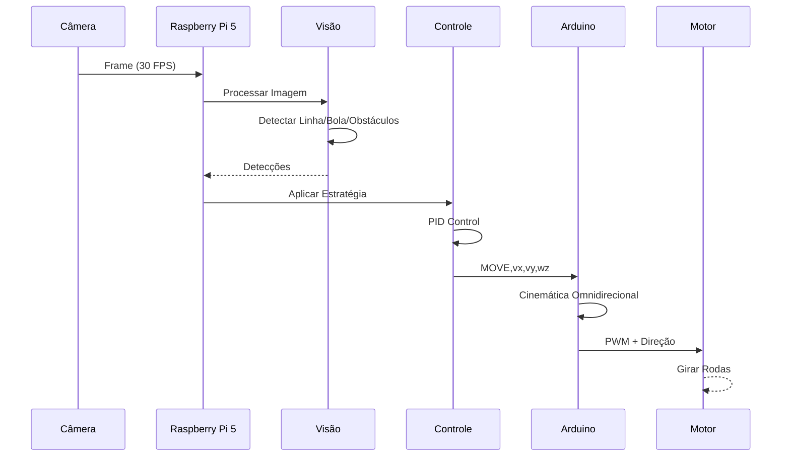

# Documentação de Montagem Física - Robô OBR 2026

## Índice

1. [Componentes Utilizados](#componentes-utilizados)
2. [Componentes Compatíveis](#componentes-compatíveis)
3. [Ligações Elétricas](#ligações-elétricas)
4. [Alimentação](#alimentação)
5. [Driver de Motores](#driver-de-motores)
6. [Servo da Garra](#servo-da-garra)
7. [Câmera](#câmera)
8. [Comunicação Serial](#comunicação-serial)
9. [Sensores Futuros](#sensores-futuros)
10. [Diagramas](#diagramas)
11. [Checklist de Montagem](#checklist-de-montagem)

---

## Componentes Utilizados

Este é o hardware **atualmente montado e funcionando** no robô.

### Processamento

| Componente | Especificação | Função |
|-----------|--------------|--------|
| **Raspberry Pi 5** | 4 GB RAM | Computador central - processamento de visão, estratégia e controle |
| **Arduino** | Uno ou Nano (recomendado Uno) | Microcontrolador - controle de motores, servo e comunicação serial |

### Movimento

| Componente | Especificação | Quantidade | Função |
|-----------|--------------|-----------|--------|
| **Motor DC com Redução** | ~3V-6V, 300-500 RPM | 4 | Propulsão omnidirecional (rodas) |
| **Roda Omnidirecional** | ~60-80mm diâmetro | 4 | Roda com rodilhos (mecanum wheels ou similar) |
| **Driver de Motor** | L298N, DRV8835 ou similar | 1 | Controle PWM e direção dos motores |

### Atuadores

| Componente | Especificação | Função |
|-----------|--------------|--------|
| **Servo Motor** | SG90, MG90S ou similar | Controle da garra de captura |

### Sensores

| Componente | Especificação | Função |
|-----------|--------------|--------|
| **Câmera** | USB ou CSI (Raspberry Pi Camera) | Percepção do ambiente e detecção de objetos |

### Energia

| Componente | Especificação | Função |
|-----------|--------------|--------|
| **Bateria/Fonte** | ~5V/2A (Raspberry) + 5-6V/2A (Arduino + motores) | Alimentação do sistema |
| **Cabo USB** | Type-C (Raspberry Pi 5) | Conexão com Raspberry Pi |
| **Cabo Micro-USB ou Serial** | Para Arduino | Comunicação e programação |

---

## Componentes Compatíveis

### Placas de Processamento

| Componente | Compatibilidade | Observações |
|-----------|----------------|-------------|
| **Raspberry Pi 5** | ✅ Totalmente Compatível | Hardware principal - recomendado |
| **Raspberry Pi 4 (2GB+)** | ✅ Totalmente Compatível | Alternativa se Pi 5 não estiver disponível |
| **Raspberry Pi 3B+** | ⚠️ Parcialmente Compatível | Mais lento, pode ter problemas com processamento de visão |
| **Raspberry Pi Zero 2W** | ❌ Não Recomendado | Muito lento para visão em tempo real |
| **Arduino Uno** | ✅ Totalmente Compatível | Padrão, recomendado |
| **Arduino Nano** | ✅ Totalmente Compatível | Compacto, mesma funcionalidade |
| **Arduino Mega** | ✅ Totalmente Compatível | Mais pinos disponíveis (útil para sensores futuros) |
| **Arduino Leonardo** | ⚠️ Parcialmente Compatível | Requer ajustes no código serial |
| **ESP32** | 🔄 Futura Compatibilidade | Requer adaptações (WiFi/Bluetooth) |

### Câmeras

| Componente | Compatibilidade | Observações |
|-----------|----------------|-------------|
| **Raspberry Pi Camera v2** | ✅ Totalmente Compatível | CSI/Flat ribbon - recomendada |
| **Raspberry Pi Camera v3** | ✅ Totalmente Compatível | CSI - melhor qualidade |
| **Câmera USB Genérica** | ✅ Totalmente Compatível | Qualquer câmera USB funciona |
| **OmniVision OV5647** | ✅ Totalmente Compatível | Sensor da câmera v2 |
| **Sony IMX708** | ✅ Totalmente Compatível | Sensor da câmera v3 |

### Motores e Rodas

| Componente | Compatibilidade | Observações |
|-----------|----------------|-------------|
| **Motor DC 3V-6V 300-500RPM** | ✅ Totalmente Compatível | Padrão recomendado |
| **Motor Stepper** | ⚠️ Parcialmente Compatível | Requer driver diferente |
| **Roda Omnidirecional (Mecanum)** | ✅ Totalmente Compatível | Padrão recomendado |
| **Roda Omnidirecional (Sueca)** | ✅ Totalmente Compatível | Alternativa |
| **Roda Normal** | ⚠️ Parcialmente Compatível | Apenas 2 rodas - requer adaptação física |

### Drivers de Motor

| Componente | Compatibilidade | Observações |
|-----------|----------------|-------------|
| **L298N Dual Motor Driver** | ✅ Totalmente Compatível | Padrão recomendado, 2A por canal |
| **DRV8835 Dual Motor Driver** | ✅ Totalmente Compatível | Mais compacto, 1.5A por canal |
| **TB6612FNG Dual Motor Driver** | ✅ Totalmente Compatível | Bom custo-benefício |
| **L298P** | ✅ Totalmente Compatível | Variante do L298N |

### Servos

| Componente | Compatibilidade | Observações |
|-----------|----------------|-------------|
| **SG90 Servo** | ✅ Totalmente Compatível | Padrão, baixa corrente |
| **MG90S Servo Metal** | ✅ Totalmente Compatível | Mais robusto |
| **MG995 High Torque** | ✅ Totalmente Compatível | Maior força de torque |
| **Qualquer servo 5V** | ✅ Totalmente Compatível | Desde que 5V e PWM padrão |

---

## Ligações Elétricas

### Pinagem do Arduino Uno/Nano

```
Arduino Uno
     GND +---+ RST
     5V  |   |  A5 (SCL)
     3V3 |   |  A4 (SDA)
     5V  |   |  A3 *
    GND  |   |  A2 *
     D2  |   |  A1
     D3  |   |  A0
     D4  |   |  GND
     D5  |   |  AREF
     D6  |   |  3V3
     D7  |   |  D13
     D8  |   |  D12
     D9  |   |  D11
    D10  |   |  D0 (RX)
    GND  +---+  D1 (TX)
    
* Pinos disponíveis para sensores futuros
```

### Tabela de Conexões de Motores

Assumindo 4 motores em configuração omnidirecional X-drive.

| Descrição | Pino Arduino | Tipo | Componente | Observações |
|-----------|-------------|------|-----------|-------------|
| **Motor 1 (FL)** |  | | | Front-Left |
| Controle Velocidade | D3 | PWM | Driver IN1 | Enable/Speed |
| Direção 1 | D4 | Digital | Driver IN2 | Sentido de rotação |
| Direção 2 | D5 | Digital | Driver IN3 | Sentido de rotação |
| **Motor 2 (FR)** |  | | | Front-Right |
| Controle Velocidade | D6 | PWM | Driver IN1 | Enable/Speed |
| Direção 1 | D7 | Digital | Driver IN2 | Sentido de rotação |
| Direção 2 | D8 | Digital | Driver IN3 | Sentido de rotação |
| **Motor 3 (RL)** |  | | | Rear-Left |
| Controle Velocidade | D9 | PWM | Driver IN1 | Enable/Speed |
| Direção 1 | D10 | Digital | Driver IN2 | Sentido de rotação |
| Direção 2 | D11 | Digital | Driver IN3 | Sentido de rotação |
| **Motor 4 (RR)** |  | | | Rear-Right |
| Controle Velocidade | D13 | Digital | Driver Enable | Pode ser PWM com modificações |
| Direção 1 | A0 | Analog | Driver IN2 | Sentido de rotação |
| Direção 2 | A1 | Analog | Driver IN3 | Sentido de rotação |

### Tabela de Conexões do Servo

| Descrição | Pino Arduino | Tipo | Componente | Observações |
|-----------|-------------|------|-----------|-------------|
| **Servo da Garra** |  | | | |
| Sinal PWM | D2 | PWM | Servo Signal | Controle de abertura/fechamento |
| 5V | 5V | Power | Servo Power | Alimentação |
| GND | GND | Ground | Servo Ground | Terra comum |

### Tabela de Conexões Serial (Arduino ↔ Raspberry)

#### Modo USB (Recomendado)

| Componente | Conexão | Observações |
|-----------|---------|-------------|
| **Arduino** | USB Type-B | Programação e comunicação |
| **Raspberry Pi 5** | USB-A (host) | Conexão com Arduino |
| **Drivers** | libftdi (automático) | Drivers CH340 ou FTDI |

#### Modo UART (GPIO do Raspberry)

**⚠️ ATENÇÃO: Nível de Tensão!**
- Raspberry Pi: 3.3V lógico
- Arduino: 5V lógico
- Requer divisor de tensão no sinal RX do Arduino

| Componente | Pino Arduino | Pino Raspberry | Tipo | Observações |
|-----------|------------|----------------|------|-------------|
| **TX (saída)** | D1 (TX) | GPIO 15 (RX) | Serial | Sinal direto (Arduino → Raspberry) |
| **RX (entrada)** | D0 (RX) | GPIO 14 (TX) | Serial | Requer divisor de tensão (3.3V) |
| **GND** | GND | GND | Power | Terra comum (essencial) |

**Divisor de Tensão para RX do Arduino:**
```
Raspberry Pi GPIO 14 (3.3V saída)
              ↓
         [Resistor 1k]
              ↓
    ┌─────────●─────────┐
    │                   │
    ↓                   ↓
Arduino D0 (RX)   [Resistor 2k2]
                        ↓
                       GND
```

### Tabela de Conexões da Câmera

#### Câmera CSI (Ribbon Cable)

| Tipo | Conexão | Observações |
|------|---------|-------------|
| **Flat Ribbon** | Camera Port no Raspberry | CSI/DSI 22-pin ou 15-pin |
| **Comprimento recomendado** | 15-30cm | Evita interferência eletromagnética |

#### Câmera USB

| Tipo | Conexão | Observações |
|------|---------|-------------|
| **USB Type-A** | Porta USB do Raspberry | Plug-and-play |
| **Alimentação** | Pode ser fornecida pelo Raspberry | Verificar consumo de corrente |

---

## Alimentação

### Requisitos de Tensão e Corrente

| Componente | Tensão Nominal | Corrente Máxima | Observações |
|-----------|--|--|--|
| **Raspberry Pi 5** | 5V | 2A | ~5W em repouso, ~10W sob carga |
| **Arduino Uno** | 5V | 500mA | ~1W em repouso |
| **Motor DC (1 unidade)** | 3-6V | 0.5-1A | Depende da carga |
| **4 Motores DC** | 5-6V | 2-4A | Sob carga máxima |
| **Servo SG90** | 5V | 0.5-1A | Máximo durante movimento |
| **Câmera USB** | 5V | 0.5A | Poder consumido por lente e sensor |
| **Câmera CSI** | 3.3V | 0.2-0.5A | Menor consumo que USB |

### Configuração de Alimentação Recomendada

```
Fonte 5V/3A (para Raspberry Pi)
    ↓
[Filtro/Capacitor]
    ↓
    ├─→ Raspberry Pi 5
    │
    └─→ [Divisor ou Fonte Separada]
            ↓
            ├─→ Arduino Uno (via USB)
            ├─→ Servo (5V)
            └─→ Driver de Motores

Fonte 6V/3A ou 5V/3A (para Motores)
    ↓
[Filtro/Capacitor]
    ↓
    └─→ Driver de Motores (IN: 6-35V, Motor: 3-6V)
```

### Recomendações

1. **Terra Comum (GND)**
   - Todos os componentes devem compartilhar a mesma referência de terra
   - Use cabos de cobre com seção adequada (mínimo 0.5mm²)

2. **Capacitores de Desacoplamento**
   - 100µF próximo ao Raspberry Pi
   - 10µF próximo ao Arduino
   - 100µF próximo ao Driver de Motores

3. **Isolamento de Ruído**
   - Mantenha cabos de motor longe de cabos de sinal
   - Use ferrite cores para reduzir interferência eletromagnética

4. **Proteção**
   - Fusível de 2-3A na linha de motores
   - Diodo de proteção (1N4007) no pino EN do driver

5. **Verificação**
   - Medir voltagem com multímetro antes de energizar
   - Começar com carga zero antes de adicionar motores
   - Monitorar temperatura dos componentes

---

## Driver de Motores

### L298N (Recomendado)

**Especificações:**
- Tensão de entrada: 5V a 35V
- Corrente máxima: 2A por canal
- 2 canais independentes
- Saída PWM para controle de velocidade

**Pinagem L298N:**

```
    ┌─────────────┐
 IN1├─────────────┤OUT1 (Motor 1+)
 IN2├─────────────┤OUT2 (Motor 1-)
 EN ├─────────────┤OUT3 (Motor 2+)
 IN3├─────────────┤OUT4 (Motor 2-)
 IN4├─────────────┤
 GND├─────────────┤GND
 +VS├─────────────┤+VS (Motor Supply)
    └─────────────┘
```

**Conexão com Arduino (para 1 driver controlando 2 motores):**

```
Arduino → L298N
D3 (PWM) → EN1 (Motor 1 velocidade)
D4 → IN1 (Motor 1 direção)
D5 → IN2 (Motor 1 direção)
D6 (PWM) → EN2 (Motor 2 velocidade)
D7 → IN3 (Motor 2 direção)
D8 → IN4 (Motor 2 direção)
GND → GND

Motor Supply: 5-6V
```

### DRV8835 (Alternativa Compacta)

**Especificações:**
- Tensão de entrada: 6.5V a 28V
- Corrente máxima: 1.5A por canal
- Mais compacto que L298N
- PWM integrado

**Pinagem e conexão similar ao L298N**

### Expansão para 4 Motores

Use 2 drivers L298N (um por par de motores):

```
Raspberry Pi
    ↓
Arduino
    ├─→ Controlador PWM/Digital
    │       ├─→ Driver 1 (Motores 1-2)
    │       └─→ Driver 2 (Motores 3-4)
    └─→ Alimentação Comum

Motor Supply: 5-6V/3A (compartilhado)
```

---

## Servo da Garra

### Servo SG90 (Padrão)

**Especificações:**
- Tensão: 5V
- Corrente: 0.5-1A em movimento
- Ângulo: 0-180°
- Torque: ~1.8 kgf·cm

**Pinagem:**
- Vermelho: 5V
- Marrom/Preto: GND
- Laranja/Amarelo: Sinal PWM

**Conexão com Arduino:**
```
Arduino D2 (PWM) → Servo Signal (Laranja/Amarelo)
Arduino 5V → Servo Power (Vermelho)
Arduino GND → Servo Ground (Marrom/Preto)
```

### Calibração do Servo

No `config.py`:
```python
kServoOpenAngle = 20    # Ângulo para abrir garra
kServoClosedAngle = 110 # Ângulo para fechar garra
```

Ajuste estes valores conforme necessário para o servo específico.

---

## Câmera

### Câmera CSI (Ribbon Cable) - Recomendada

**Vantagens:**
- Menor latência
- Menor consumo de energia
- Melhor integração com Raspberry Pi
- Drivers otimizados (Picamera2, libcamera)

**Instalação:**

1. Desligar o Raspberry Pi
2. Localizar o conector CSI (perto do conector HDMI)
3. Levantar a aba plástica do conector
4. Inserir o ribbon cable (lado azul/preto para a câmera)
5. Abaixar a aba plástica
6. Energizar e testar

**Compatibilidade de Ribbon Cable:**

| Tipo | Comprimento | Uso |
|------|------------|-----|
| 15-pin (mais comum) | Até 30cm | Câmera v2, v3 |
| 22-pin | Até 50cm | Câmera de alta resolução |

### Câmera USB

**Vantagens:**
- Plug-and-play
- Compatibilidade universal
- Pode usar cabo de extensão

**Instalação:**

1. Conectar a câmera em qualquer porta USB do Raspberry Pi
2. Verificar com `lsusb` no terminal
3. Usar backend OpenCV (cv2.VideoCapture)

**Desvantagens:**
- Maior latência
- Maior consumo de energia
- Requer driver no Raspberry (geralmente automático)

### Seleção de Backend no Software

No `config.py`:
```python
CAMERA_BACKEND = "auto"  # ou "picamera2", "libcamera", "rpicam", "opencv"
CAMERA_BACKEND_PREFERENCE = ("picamera2", "libcamera", "rpicam", "opencv")
```

**Prioridade de seleção:**
1. **picamera2**: Melhor para câmeras CSI em Raspberry Pi OS
2. **libcamera**: Backend de câmera moderno
3. **rpicam**: Alternativa em tempo real
4. **opencv**: Fallback universal (câmeras USB)

---

## Comunicação Serial

### Modo USB (Padrão)

**Vantagens:**
- Simples (plug-and-play)
- Automático no Raspberry Pi
- Também programa o Arduino

**Como usar:**

1. Conectar Arduino ao Raspberry via USB
2. No `config.py`:
   ```python
   SERIAL_MODE = "usb"
   SERIAL_PORT = "auto"
   ```
3. O software encontra a porta automaticamente

**Portas típicas:**
- Linux: `/dev/ttyUSB0`, `/dev/ttyUSB1`, etc.
- Windows: `COM3`, `COM4`, etc.
- macOS: `/dev/tty.usbserial-*`

### Modo UART (GPIO)

**Vantagens:**
- Sem cabos extras
- Dedicado (não compartilha com USB)
- Menor latência

**Como usar:**

1. **Desabilitar console serial no Raspberry Pi:**
   ```bash
   sudo raspi-config
   # Interface Options → Serial Port → Disable
   # Serial Port Login → Disable
   ```

2. **Conectar fisicamente:**
   - Raspberry GPIO 14 (TX) → Arduino D0 (RX) [com divisor 3.3V→5V]
   - Raspberry GPIO 15 (RX) → Arduino D1 (TX)
   - Raspberry GND → Arduino GND

3. **No `config.py`:**
   ```python
   SERIAL_MODE = "uart"
   SERIAL_PORT = "/dev/ttyAMA0"  # ou "/dev/serial0"
   ```

**⚠️ MUITO IMPORTANTE - Divisor de Tensão:**

O Raspberry enviar 3.3V, o Arduino espera 5V. Porém, é **seguro** conectar 3.3V ao D0 (RX) do Arduino.

Mas se usar 5V do Arduino no pino RX do Raspberry (3.3V), pode danificar!

**Esquema correto:**

```
Arduino TX (5V) → [1k resistor] → Raspberry RX (3.3V)
                       ↓
                    [2.2k resistor]
                        ↓
                       GND
```

Sem o divisor, use apenas:
- Arduino TX → Raspberry RX (direto, 5V para 3.3V é tolerável)
- Raspberry TX → Arduino RX (deve usar divisor ou conversor de nível)

**Alternativa: Conversor de Nível Lógico**
- Compacto e confiável
- Exemplo: PCA9306, TXB0108

---

## Sensores Futuros

A arquitetura foi projetada para suportar sensores adicionais sem modificar o código existente.

### Sensor Ultrassônico

**Quando adicionar:** Quando precisar de detecção de proximidade redundante

**Hardware sugerido:**
- HC-SR04 (popular, baixo custo)
- ou HY-SRF05

**Pinos do Arduino:**
- TRIG: A2 (pino digital)
- ECHO: A3 (pino com INPUT_PULLUP)

**Adaptação no código:**
1. Descomentar `initUltrasonic()` em `setup()`
2. Registrar sensor em `sensor_manager`
3. Deixar lógica de fallback para visão

### Sensor ToF (Time of Flight)

**Quando adicionar:** Para detecção de obstáculos mais precisa

**Hardware sugerido:**
- VL53L0X
- VL53L1X
- TMF8801

**Comunicação:** I2C (pinos SDA, SCL do Arduino)

**Vantagens:**
- Mais preciso que ultrassônico
- Funciona em luz ambiente forte
- Alcance 30-200cm

### IMU (Inertial Measurement Unit)

**Quando adicionar:** Para navegação mais precisa (futuro)

**Hardware sugerido:**
- MPU6050 (aceleração + giroscópio)
- MPU9250 (aceleração + giroscópio + bússola)
- BNO055

**Comunicação:** I2C

**Utilidade:**
- Estimação de orientação
- Detecção de impacto
- Estabilização de movimento

### Encoders (Odometria)

**Quando adicionar:** Para cálculo de posição baseado em movimento

**Hardware sugerido:**
- Encoder magnético nos eixos dos motores
- Sensor Hall effect no rotor

**Comunicação:** Digital (pulsos contados)

**Utilidade:**
- Odometria (estimação de posição)
- Detecção de escorregamento
- Calibração de movimento

### LiDAR

**Quando adicionar:** Para mapeamento 360° do ambiente

**Hardware sugerido:**
- RPLiDAR A1
- RPLiDAR A2
- Slamtec Mapper

**Comunicação:** Serial UART

**Utilidade:**
- Mapeamento SLAM
- Detecção de obstáculos em todas as direções
- Navegação autonôma avançada

---

## Diagramas

### Arquitetura Geral do Sistema


### Fluxo de Dados



### Conexão Eletrônica (Visão Simplificada)

```
┌─────────────────────────────────────────┐
│                                         │
│  Raspberry Pi 5                         │
│  ├─ Camera Port ──→ Câmera CSI         │
│  ├─ USB ──→ Arduino ou Câmera USB      │
│  └─ GPIO 14,15 (TX,RX) ──→ UART       │
│                                         │
└─────────────────────────────────────────┘
                    │
                    ↓
┌─────────────────────────────────────────┐
│  Arduino Uno                            │
│  ├─ D0,D1 ──→ Serial (Raspberry)       │
│  ├─ D2 ──→ Servo                       │
│  ├─ D3-D11, A0-A1 ──→ Driver Motores  │
│  └─ A2,A3 (Futuros: Ultrassônico)     │
└─────────────────────────────────────────┘
         │               │
         ↓               ↓
    ┌─────────┐     ┌─────────┐
    │ Servo   │     │ Driver  │
    │ (Garra) │     │ Motores │
    └─────────┘     └─────────┘
                         │
                    ┌────┴────┐
                    ↓         ↓
                  Motor 1   Motor 2-4
```

---

## Checklist de Montagem

### Antes de Conectar

- [ ] Verificar voltagem de todas as fontes (multímetro)
- [ ] Verificar continuidade dos cabos de GND
- [ ] Revisar todas as conexões contra a tabela acima
- [ ] Confirmar polaridade de componentes (bateria, capacitores, etc.)
- [ ] Verificar se não há curto-circuito

### Montagem Eletrônica

- [ ] **Raspberry Pi**: Encaixar SDCard, SSD (se houver)
- [ ] **Câmera CSI**: Conectar ribbon cable ao conector CSI
- [ ] **Arduino**: Conectar via USB ao Raspberry Pi
- [ ] **Driver de Motores**: Conectar pinos do Arduino (D3-D11, A0-A1)
- [ ] **Servo**: Conectar sinal (D2), 5V, GND
- [ ] **Motores**: Conectar ao driver
- [ ] **Bateria/Fonte**: Conectar com segurança (fusível recomendado)
- [ ] **GND Comum**: Verificar que todos os negativos estão conectados

### Teste Inicial

- [ ] Energizar apenas o Raspberry Pi (sem Arduino nem motores)
- [ ] Verificar se a câmera está sendo detectada (`ls /dev/video*`)
- [ ] Energizar o Arduino via USB
- [ ] Testar comunicação serial: `python3 -c "import serial; s = serial.Serial('/dev/ttyUSB0', 115200); print(s.readline())"`
- [ ] Energizar driver e motores separadamente
- [ ] Testar cada motor individualmente (com PWM = 0 inicialmente)
- [ ] Testar servo (deve mover de forma controlada)

### Teste de Integração

- [ ] Executar aplicação de teste: `python3 -m pytest tests/`
- [ ] Verificar leitura de câmera em tempo real
- [ ] Verificar envio de comandos ao Arduino
- [ ] Verificar movimento dos motores
- [ ] Verificar atuação do servo

### Montagem Física

- [ ] Fixar Raspberry Pi à chassi
- [ ] Fixar Arduino à chassi
- [ ] Fixar driver de motores
- [ ] Fixar bateria/fonte com segurança
- [ ] Organizar cabos (evitar cruzamento com motores)
- [ ] Usar ferrite cores em cabos de motor
- [ ] Testar cinemática omnidirecional em todas as direções
- [ ] Calibrar PID para navegação em linha reta
- [ ] Testar detecção de objetos e obstáculos

---

## Referências e Recursos

### Documentação Oficial

- [Raspberry Pi 5 Documentation](https://www.raspberrypi.com/documentation/computers/raspberry-pi.html)
- [Arduino Reference](https://www.arduino.cc/reference/)
- [OpenCV Documentation](https://docs.opencv.org/)

### Componentes Populares

- [L298N Datasheet](http://www.alldatasheet.com/datasheet-pdf/pdf/86449/STMICROELECTRONICS/L298N.html)
- [SG90 Servo Documentation](https://www.datasheetsworld.com/SG90-pdf.html)
- [HC-SR04 Ultrasonic Documentation](https://cdn.sparkfun.com/assets/b/e/4/b/1584cd13bf59c6a8_HC-SR04_Ultrasonic_Sensor.pdf)

### Comunidades

- Comunidade OpenCV
- Arduino Forums
- Raspberry Pi Forum
- RoboCup OBR Brasil

---

## Notas Finais

Esta documentação deve ser **atualizada automaticamente** quando houver mudanças no hardware suportado ou nas ligações elétricas. O objetivo é manter a documentação sincronizada com o código-fonte.

**Última atualização:** 2 de Julho de 2026
**Versão:** 1.0
**Status:** Hardware com visão computacional apenas - Sensores adicionais são opcionais
