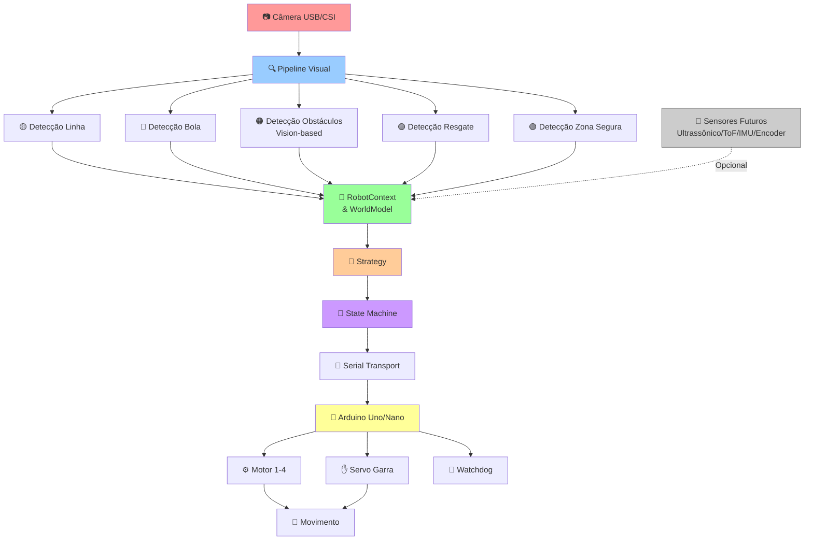
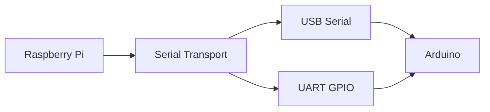
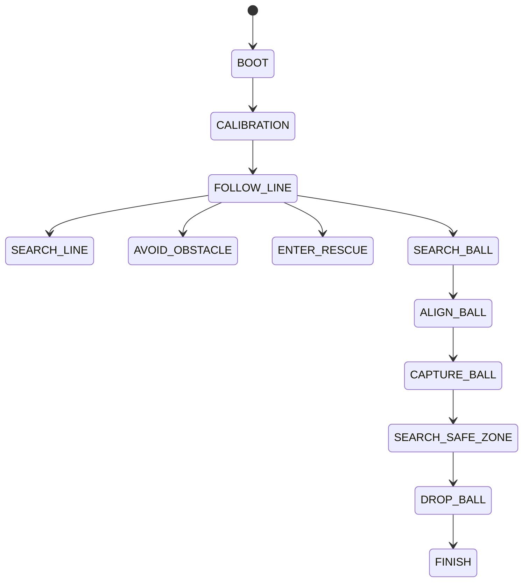

# Projeto OBR 2026 - Robô Competição

## Visão Geral

Este projeto reúne um software modular para operar um robô de competição da OBR com um Raspberry Pi e um Arduino. A arquitetura foi organizada para priorizar:

- **modularidade**: cada componente é independente e testável;
- **desempenho em hardware embarcado**: otimizado para Raspberry Pi com câmera USB/CSI;
- **tolerância a falhas**: funciona mesmo sem sensores opcionais;
- **separação de responsabilidades**: percepção (câmera), decisão (Raspberry), atuação (Arduino);
- **compatibilidade**: suporta USB e UART para comunicação com Arduino;
- **extensibilidade**: arquitetura pronta para adicionar sensores futuros sem alterar código existente.

**Ponto-chave:** O robô funciona **integralmente com visão computacional** como sensor de percepção. Sensores de distância (ultrassônico, ToF, LiDAR) são **opcionais** e não bloqueiam a operação.

### Hardware Atualmente Disponível

- Raspberry Pi 5 (4 GB)
- Arduino (Uno ou Nano)
- Câmera (USB ou CSI) - **único sensor obrigatório**
- 4 motores omnidirecionais
- Driver de motores
- Servo da garra
- Comunicação serial (USB ou UART)

**Nota:** Não há sensor ultrassônico, ToF, LiDAR ou qualquer outro sensor de distância instalado atualmente. O projeto foi completamente adaptado para funcionar apenas com visão computacional.

O sistema é responsável por:

- capturar e processar imagens da câmera;
- executar detectores de visão (linha, bola, obstáculos, resgate, zona segura);
- interpretar o ambiente usando apenas análise de imagem;
- controlar a máquina de estados;
- decidir comportamentos de navegação baseados em visão;
- enviar comandos ao Arduino via serial;
- receber feedback e eventos do Arduino.

### Objetivo

Manter o robô responsivo, estável e escalável durante a competição, funcionando com o hardware disponível e preparado para futuros sensores.

### Arquitetura Geral

O software é dividido em blocos bem definidos:

1. **Câmera & Visão**: captura e processamento de imagens
2. **Sensores**: abstração extensível (atualmente apenas visão, futuros: ultrassônico, ToF, IMU, encoders, LiDAR)
3. **Raspberry Pi**: execução de visão, estratégia, máquina de estados
4. **Arduino**: controle de baixo nível (motores, servo, watchdog)
5. **Comunicação Serial**: camada abstrata USB/UART

### Fluxo de Funcionamento

1. A câmera captura frames continuamente
2. O pipeline visual processa os frames em 30 FPS
3. Detectores identificam linha, obstáculos, bola, resgate, zona segura
4. O contexto do robô é atualizado com os resultados
5. A estratégia escolhe o próximo comportamento baseado nas detecções
6. A máquina de estados executa o comportamento
7. Os comandos são enviados ao Arduino por serial
8. O Arduino executa motores, servo e vigilância de segurança
9. Ciclo continua (loop principal ~30ms)



## Arquitetura

### Raspberry Pi

O Raspberry Pi executa a camada de alto nível do robô. Ele é responsável por:

- capturar e processar imagens;
- executar detectores de visão;
- manter o WorldModel;
- decidir a estratégia atual;
- executar a máquina de estados;
- enviar comandos ao Arduino;
- tratar eventos recebidos pela serial.

Os principais módulos Python estão em:

- [raspberry/main.py](raspberry/main.py): ponto de entrada da aplicação.
- [raspberry/camera.py](raspberry/camera.py): abstração de câmera.
- [raspberry/serial_manager.py](raspberry/serial_manager.py): camada de comunicação serial.
- [raspberry/communication.py](raspberry/communication.py): transporte abstrato para USB/UART.
- [raspberry/state_machine.py](raspberry/state_machine.py): máquina de estados.
- [raspberry/strategy.py](raspberry/strategy.py): seleção de decisões.
- [raspberry/runtime.py](raspberry/runtime.py): controle de taxa e latência.

### Arduino

O Arduino é responsável por executar o controle de baixo nível:

- controlar motores com cinemática omnidirecional;
- aplicar PWM e direção baseado em velocidades (vx, vy, wz);
- controlar servo da garra (abertura e fechamento);
- vigilância com watchdog (timeout após 1 segundo sem comando);
- receber comandos do Raspberry via serial;
- responder com confirmação ou eventos;
- manter saída livre de travar.

O firmware está concentrado em um único arquivo otimizado:

- [arduino/robot.ino](arduino/robot.ino) (~250 linhas)

- Versão para Mega: [arduino/robot_mega.ino](arduino/robot_mega.ino) e guia em [arduino/MEGA.md](arduino/MEGA.md).

Ele mantém a lógica bem estruturada:

- **setup()**: inicialização de motores, servo e serial
- **loop()**: leitura de comandos, atualização de watchdog, controle de motores
- **handleCommand()**: parse e execução de comandos MOVE, GRAB, RELEASE, SERVO, STOP, PING
- **applyOmniMotion()**: conversão de velocidades (vx, vy, wz) para PWM dos 4 motores
- Proteção contra travamento via watchdog
- envio de eventos.

### Comunicação Serial

A camada serial foi projetada para ser transparente para o resto do sistema. O Raspberry pode usar:

- USB Serial (`/dev/ttyACM*`, `/dev/ttyUSB*`);
- UART nos pinos GPIO do Raspberry (`/dev/serial0`, `/dev/ttyAMA0`, `/dev/ttyS0`).

A interface é a mesma, mudando apenas o dispositivo configurado.



### Visão Computacional

A visão é processada em um pipeline leve e otimizado:

- captura do frame;
- redução de resolução opcional;
- ROI configurável;
- conversão para HSV;
- aplicação de máscaras;
- detecção de linha, bola, zona segura e resgate.

Os detectores estão em:

- [raspberry/vision/line_detector.py](raspberry/vision/line_detector.py)
- [raspberry/vision/ball_detector.py](raspberry/vision/ball_detector.py)
- [raspberry/vision/rescue_detector.py](raspberry/vision/rescue_detector.py)
- [raspberry/vision/safe_zone_detector.py](raspberry/vision/safe_zone_detector.py)
- [raspberry/vision/pipeline.py](raspberry/vision/pipeline.py)

### Máquina de Estados

A máquina de estados executa rapidamente e não bloqueia o sistema. Cada estado retorna um comando e, quando necessário, uma transição.

Estados principais:

- BOOT
- CALIBRATION
- FOLLOW_LINE
- SEARCH_LINE
- AVOID_OBSTACLE
- ENTER_RESCUE
- SEARCH_BALL
- ALIGN_BALL
- CAPTURE_BALL
- SEARCH_SAFE_ZONE
- DROP_BALL
- FINISH



### Behavior Manager

O comportamento atual é decidido pela estratégia e pela máquina de estados. O módulo de comportamento do projeto de competição também está presente em [competition](competition).

### Mission Manager

Responsável pela fase da missão e por transições de alto nível.

### WorldModel

Representa o estado percebido do robô, incluindo:

- presença de linha;
- obstáculo detectado;
- bola detectada;
- zona segura detectada;
- status da câmera;
- status da serial;
- eventos recentes.

### Sensor Fusion

Combina sinais de sensores (quando disponíveis) e visão para preparar o contexto da decisão estratégica. O sistema funciona perfeitamente apenas com visão; sensores adicionais melhoram a redundância e confiabilidade.

### Navigator

Converte a decisão do comportamento em comando de movimento ou ação para o Arduino.

## Estrutura de Pastas

```text
2026/novo_projeto/
├── arduino/
│   └── robot.ino                # Firmware do Arduino em um único arquivo (~250 linhas)
├── competition/
│   ├── behaviors/               # Comportamentos de alto nível
│   ├── config/                  # Configuração da competição
│   ├── navigation/              # Navigator e lógica de navegação
│   ├── vision/                  # Detecção e percepção da competição
│   ├── behavior_manager.py      # Gerenciador de comportamentos
│   ├── mission_manager.py       # Gerenciador de fase da missão
│   ├── sensor_fusion.py         # Fusão de sinais e sensores
│   ├── state_machine.py         # Máquina de estados da competição
│   └── world_model.py           # Modelo global de estado
├── raspberry/
│   ├── camera.py                # Abstração da câmera
│   ├── communication.py         # Camada abstrata de serial USB/UART
│   ├── config.py                # Configurações de runtime
│   ├── main.py                  # Ponto de entrada do robô
│   ├── runtime.py               # Controle de taxa e latência
│   ├── serial_manager.py        # Adaptador para a camada serial
│   ├── sensor_interface.py      # Interfaces abstratas para sensores
│   ├── sensors_future.py        # Placeholders para sensores futuros
│   ├── state_machine.py         # Máquina de estados do robô
│   ├── strategy.py              # Estratégia do robô
│   ├── pid.py                   # Controlador PID simples
│   ├── states/                  # Estados do robô (11 estados)
│   └── vision/                  # Detectores e pipeline visual
│       ├── line_detector.py     # Detecção de linha preta
│       ├── ball_detector.py     # Detecção de bola
│       ├── rescue_detector.py   # Detecção de zona de resgate
│       ├── safe_zone_detector.py# Detecção de zona segura
│       ├── obstacle_detector.py # Detecção de obstáculos (vision-based)
│       └── pipeline.py          # Pipeline integrado de visão
├── tests/
│   ├── test_camera_manager.py
│   ├── test_competition_architecture.py
│   ├── test_state_machine.py
│   ├── test_vision_pipeline.py
│   └── test_runtime_controller.py
├── README.md                    # Este arquivo
└── HARDWARE.md                  # Documentação completa de montagem física
```

## Requisitos

### Hardware (Atualmente Instalado)

- **Raspberry Pi 5** com 4 GB de RAM (Pi 4 compatível, Pi 3B+ tolerável);
- **Arduino** Uno ou Nano (compatível com serial USB/UART);
- **Câmera** USB genérica ou CSI do Raspberry Pi;
- **4 Motores DC** (3-6V) com redução para omnidirecional;
- **4 Rodas Omnidirecionais** (mecanum ou suecas);
- **Driver de Motores** L298N ou equivalente;
- **Servo SG90** para controle da garra;
- **Fonte de Alimentação** estável (5V/3A mínimo para Raspberry + Arduino + servo);

### Hardware (Opcional - para futuro)

- Sensor Ultrassônico (HC-SR04 ou similar)
- Sensor ToF (VL53L0X, VL53L1X)
- IMU (MPU6050, MPU9250)
- Encoders (para odometria)
- LiDAR (RPLiDAR A1/A2)

**Nota:** O projeto funciona **100% com hardware atualmente instalado**. Sensores opcionais aumentam redundância, mas não são obrigatórios.

### Software

- **Raspberry Pi OS** 64-bit ou similar Linux
- **Python** 3.11+
- **OpenCV** (cv2)
- **NumPy**
- **PyYAML**
- **pyserial**
- **pytest** (opcional para testes)

### Câmeras compatíveis

- câmera CSI do Raspberry Pi;
- câmera USB;
- backends compatíveis com OpenCV.

## Instalação

### 1. Preparar o Raspberry Pi

```bash
sudo apt update && sudo apt upgrade -y
sudo apt install -y python3 python3-venv python3-pip python3-dev
sudo apt install -y python3-picamera2 python3-opencv python3-numpy
```

O `numpy` e o `opencv` vêm do sistema, **não do pip** — veja o passo 2. O
`python3-opencv` do apt também traz GUI e GStreamer, que os wheels do pip não têm.

### 2. Criar ambiente virtual

```bash
cd /home/pi/Desktop/novo_projeto
./scripts/setup_dev_env.sh
source .venv/bin/activate
```

O script cria um ambiente virtual local e instala as dependências de desenvolvimento
com o mesmo fluxo em qualquer máquina desktop/CI:

```bash
python3 -m pip install -r requirements-dev.txt
```

> **Não instale `numpy` nem `opencv-python` pelo pip no Raspberry Pi.**
> No Raspberry Pi, prefira o sistema (`python3-picamera2`, `python3-opencv`, `python3-numpy`).
> Para desenvolvimento em desktop/CI, o script usa `requirements-dev.txt` e garante
> que `cv2` e `yaml` estejam disponíveis sem depender de configurações manuais.

Para rodar a suíte completa:

```bash
python3 -m unittest discover -s tests -q
```

### 3. Configurar a câmera

Para usar a câmera CSI do Raspberry Pi, verifique se o sistema está com o suporte habilitado.

```bash
sudo raspi-config
```

Ative:

- Interface Options → Camera
- Serial Port (se for usar UART, conforme necessário)

Para a câmera CSI (Camera Module), o backend usado é o `picamera2`, que é instalado
pelo sistema e não pelo pip. Por isso o venv precisa enxergar os pacotes do sistema:

```bash
sudo apt install -y python3-picamera2
python3 -m venv --system-site-packages .venv
```

Câmera USB não precisa disso: cai no backend `opencv` automaticamente.

### 4. Preview na tela

Rodando em um terminal da área de trabalho do Raspberry Pi, o robô abre uma janela
com a imagem da câmera ao vivo e o que a visão está detectando desenhado por cima:

- retângulo azul: a ROI analisada (só a faixa inferior do quadro);
- linha cinza vertical: o centro de referência do erro;
- linha verde: onde a linha foi detectada;
- círculo laranja: a bola, com a distância estimada;
- barra superior: estado, comando enviado ao Arduino, erro em pixels, FPS da visão e latência do loop.

Pressione `q` (ou ESC) com a janela em foco para encerrar o robô.

O preview exige o pacote **`opencv-python`** — o `opencv-python-headless` não tem
janelas e o preview se desativa sozinho, avisando no log. Controle pelo
`PREVIEW_MODE` em [raspberry/config.py](raspberry/config.py) ou pela variável de ambiente:

```bash
ROBOT_PREVIEW=off ./run_robot.sh   # desliga
ROBOT_PREVIEW=on  ./run_robot.sh   # força mesmo sem display detectado
```

### 5. Configurar a serial

Para usar USB:

```bash
ls /dev/ttyACM* /dev/ttyUSB* 2>/dev/null
```

Para usar UART:

```bash
ls /dev/serial0 /dev/ttyAMA0 /dev/ttyS0 2>/dev/null
```

### 6. Gravar o firmware no Arduino

Abra o arquivo [arduino/robot.ino](arduino/robot.ino) no Arduino IDE e faça o upload para o microcontrolador.

### 7. Configurar o Raspberry Pi

Edite os parâmetros em [raspberry/config.py](raspberry/config.py) conforme o hardware disponível.

Exemplo:

```python
SERIAL_MODE = "auto"
SERIAL_PORT = "auto"
SERIAL_BAUDRATE = 115200
SERIAL_TIMEOUT = 0.1
```

## Configuração

### Arquivo de configuração principal

- [raspberry/config.py](raspberry/config.py)

### Parâmetros principais

| Seção | Parâmetro | Descrição |
|---|---|---|
| Serial | `SERIAL_MODE` | `auto`, `usb` ou `uart` |
| Serial | `SERIAL_PORT` | porta específica ou `auto` |
| Serial | `SERIAL_BAUDRATE` | velocidade da serial |
| Serial | `SERIAL_TIMEOUT` | timeout de leitura |
| Câmera | `CAMERA_BACKEND` | backend da câmera |
| Câmera | `CAMERA_WIDTH` | largura da imagem |
| Câmera | `CAMERA_HEIGHT` | altura da imagem |
| Visão | `VISION_PROCESS_WIDTH` | largura usada no processamento |
| Visão | `VISION_PROCESS_HEIGHT` | altura usada no processamento |
| Visão | `VISION_ROI` | região de interesse |
| PID | `PID_KP`, `PID_KI`, `PID_KD` | parâmetros do controlador |
| Estratégia | `MAX_STEER` | limite do steering |

## Como Executar

### Modo real

```bash
cd /home/pi/Desktop/novo_projeto
source .venv/bin/activate
python raspberry/main.py
```

### Execução dos testes

```bash
cd /home/pi/Desktop/novo_projeto
source .venv/bin/activate
python -m unittest discover -s tests -p 'test*.py'
```

### Seleção automática da serial

A configuração padrão já tenta:

1. USB Serial;
2. UART do Raspberry Pi;
3. reconectar periodicamente em caso de falha.

### Calibração

Antes da competição, teste:

- câmera;
- detecção visual (linha, bola, obstáculos, resgate, zona segura);
- garra;
- motores (todos os 4 em todas as direções);
- comunicação serial (USB ou UART);
- ciclo completo de navegação.

## Comunicação Serial

### Protocolo

O Raspberry envia comandos textuais com final de linha `\n`.
O Arduino responde com confirmação imediata.

### Comandos enviados ao Arduino

| Comando | Descrição | Exemplo |
|---|---|---|
| `STOP` | para o robô | `STOP\n` |
| `MOVE,vx,vy,wz` | movimento omnidirecional | `MOVE,50,-30,10\n` |
| `GRAB` | fecha a garra | `GRAB\n` |
| `RELEASE` | abre a garra | `RELEASE\n` |
| `PING` | teste de comunicação | `PING\n` |
| `HEARTBEAT` | keepalive de comunicação; não comanda movimento | `HEARTBEAT\n` |
| `SERVO,angle` | ajusta ângulo servo (20-110°) | `SERVO,90\n` |

### Respostas do Arduino

| Resposta | Descrição | Quando |
|---|---|---|
| `OK` | comando aceito e executado | sempre |
| `BALL_CAPTURED` | garra fechou com sucesso | após `GRAB` |
| `BALL_DROPPED` | garra abriu com sucesso | após `RELEASE` |
| `PONG` | resposta ao ping | após `PING` |
| `WATCHDOG` | timeout de comando (>1s) | quando inativo |
| `READY` | Arduino inicializado | ao ligar |
| `ERROR` | comando inválido ou mal formado | se inválido |

### Heartbeat e watchdog

- O Raspberry envia `HEARTBEAT` periodicamente como keepalive da ligação serial.
- O Arduino interpreta `HEARTBEAT` como sinal de vida e reseta o watchdog local sem executar movimento.
- Se o Arduino não receber comandos válidos nem `HEARTBEAT` por mais de 1 segundo, ele para os motores e envia `WATCHDOG`.
- O Raspberry trata `WATCHDOG` como falha explícita de comunicação e entra em estado seguro enviando `STOP`.
- A serial é reconectada automaticamente sem encerrar a aplicação; após o retorno do tráfego, o watchdog é limpo e o sistema volta ao fluxo normal.

## Máquina de Estados

Cada estado executa rapidamente e devolve um comando para o Arduino.

### Estados

- `BOOT`: inicialização.
- `CALIBRATION`: calibração inicial.
- `FOLLOW_LINE`: segue a linha.
- `SEARCH_LINE`: procura a linha.
- `AVOID_OBSTACLE`: evita obstáculo.
- `ENTER_RESCUE`: entra na área de resgate.
- `SEARCH_BALL`: procura a bola.
- `ALIGN_BALL`: alinha com a bola.
- `CAPTURE_BALL`: captura a bola.
- `SEARCH_SAFE_ZONE`: procura a zona segura.
- `DROP_BALL`: deposita a bola.
- `FINISH`: finaliza a missão.

## Behaviors

Os comportamentos são implementados em [competition/behaviors](competition/behaviors) e descrevem a lógica de alto nível da competição.

## Visão Computacional

### Pipeline

1. captura do frame;
2. redução/configuração da imagem;
3. ROI opcional;
4. conversão BGR → HSV;
5. máscara por cor;
6. morfologia;
7. detecção de contornos;
8. atualização do WorldModel.

### Detectores atuais

- Linha
- Bola
- Resgate
- Zona segura

### Como adicionar um novo detector

1. crie uma nova classe em [raspberry/vision](raspberry/vision);
2. implemente `detect_from_hsv(...)`;
3. registre o detector em [raspberry/main.py](raspberry/main.py);
4. atualize o `RobotContext` se necessário.

## Desenvolvimento

### Padrões de código

- manter módulos pequenos e coesos;
- evitar blocos longos no loop principal;
- favorecer filas e desacoplamento;
- preservar compatibilidade com o restante do sistema;
- preferir simplicidade.

### Como adicionar novos comportamentos

1. crie uma nova classe de estado em [raspberry/states](raspberry/states);
2. registre o estado na máquina em [raspberry/main.py](raspberry/main.py);
3. implemente a lógica de transição em [raspberry/strategy.py](raspberry/strategy.py).

### Como adicionar novos sensores

A arquitetura foi projetada para suportar sensores adicionais sem alterar o código existente.

**Sensores já implementados (ou placeholders):**
- Câmera (USB/CSI) - **implementada**
- Detecção de obstáculos baseada em visão - **implementada**
- Ultrassônico - **placeholder** (pronto para integração)
- ToF - **placeholder** (pronto para integração)
- IMU - **placeholder** (pronto para integração)
- Encoders - **placeholder** (pronto para integração)
- LiDAR - **placeholder** (pronto para integração)

**Para adicionar um novo sensor:**

1. Implemente a interface apropriada em [raspberry/sensor_interface.py](raspberry/sensor_interface.py):
   - `ObstacleDetector` - para detectores de obstáculos
   - `DistanceSensor` - para sensores de distância
   - `IMUSensor` - para sensores IMU
   - `EncoderSensor` - para sensores de encoder

2. Crie a implementação concreta e registre no `SensorManager` em [raspberry/main.py](raspberry/main.py)

3. O resto do sistema funciona automaticamente!

Ver [HARDWARE.md](HARDWARE.md) para pinagem e instruções de montagem de sensores futuros.

### Como adicionar novas câmeras

- use o backend configurado em [raspberry/camera.py](raspberry/camera.py);
- ajuste os parâmetros em [raspberry/config.py](raspberry/config.py).

### Como adicionar novos backends de comunicação

- implemente uma nova classe compatível com a interface da camada serial;
- preserve a mesma API usada em [raspberry/serial_manager.py](raspberry/serial_manager.py).

## Testes

Os testes automatizados podem ser executados com:

```bash
cd /home/leosouza/Desktop/trabalho/2026/novo_projeto
python -m pytest tests/
# ou
python -m unittest discover -s tests -p 'test*.py'
```

## Solução de Problemas

| Problema | Possível causa | Solução |
|---|---|---|
| Câmera não detectada | backend incompatível | ajuste `CAMERA_BACKEND` em config.py |
| Arduino não encontrado | porta errada ou desconectado | verifique USB/UART e `SERIAL_MODE` |
| Perda de comunicação serial | cabo ruim ou timeout | ajuste `SERIAL_TIMEOUT` e verifique conexão física |
| OpenCV error | dependências ausentes | reinstale `opencv-python` |
| Baixa taxa de FPS | resolução alta ou processamento pesado | reduza `VISION_PROCESS_WIDTH/HEIGHT` |
| Detecção ruim de linha | iluminação inadequada | ajuste os thresholds HSV em config.py |
| Detecção de obstáculos falha | visão obscurecida | limpe a câmera, ajuste confiança |
| Falha na garra | servo sem poder ou conectado errado | teste servo isoladamente, verifique fonte |
| Motores não giram | driver sem alimentação | verifique alimentação do driver e motores |
| Problemas de alimentação | corrente insuficiente | use fonte adequada (5V/3A mínimo) |
| UART não funciona | console serial ativado | desative com `raspi-config` |

## Checklist para Competição

- [ ] Bateria carregada (5-6V para motores, 5V para Raspberry);
- [ ] Câmera funcionando e limpa;
- [ ] Comunicação serial ativa (USB ou UART);
- [ ] Detecção de linha calibrada;
- [ ] Detecção de obstáculos testada;
- [ ] Detecção de bola calibrada;
- [ ] Garra funciona (abrir e fechar);
- [ ] Motores funcionam (todos os 4 em todas as direções);
- [ ] Servo testado;
- [ ] Loop principal executando em ~30ms;
- [ ] Testes automatizados passando.

## Roadmap

**Curto Prazo (Atual):**
- ✅ Remover dependência de sensores de distância
- ✅ Implementar detecção de obstáculos por visão
- ✅ Criar arquitetura extensível para sensores
- ✅ Documentar montagem física (HARDWARE.md)

**Médio Prazo:**
- [ ] Integrar sensor ultrassônico (opcional, para redundância)
- [ ] Integrar sensor ToF (opcional)
- [ ] Implementar SLAM básico com LiDAR (futuro)
- [ ] Adicionar IMU para estabilização (futuro)
- [ ] Implementar odometria com encoders (futuro)

**Longo Prazo:**
- [ ] Logs em arquivo para análise pós-competição
- [ ] Modo de simulação mais completo
- [ ] Estratégia de decisão melhorada
- [ ] Calibração automática de câmera
- [ ] Protocolo serial binário (mais eficiente)
- [ ] Streaming de vídeo para debug remoto

## Documentação

- **README.md**: Este arquivo (visão geral e guia de uso)
- **HARDWARE.md**: Documentação completa de montagem física, pinagem e compatibilidade
- **[arduino/robot.ino](arduino/robot.ino)**: Firmware do Arduino bem comentado
- **[raspberry/config.py](raspberry/config.py)**: Todas as configurações do sistema
- **[raspberry/sensor_interface.py](raspberry/sensor_interface.py)**: Interfaces para adicionar sensores

## Licença

Este projeto é distribuído sob a licença MIT.
