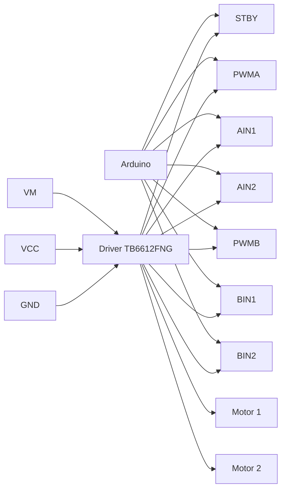

# TB6612FNG no robô OBR 2026

Este documento é um guia técnico completo para a utilização do driver de motores TB6612FNG no robô omnidirecional da OBR. Ele reúne informações de montagem elétrica, pinagem, alimentação, programação, integração com o firmware, cinemática omni, calibração e diagnóstico.

> O objetivo é que qualquer integrante da equipe consiga entender, montar, programar e depurar o sistema sem depender de conhecimento tácito.

---

## 1. Visão Geral

### O que é o TB6612FNG?

O TB6612FNG é um driver de motor em ponte H de baixo custo, compacto e muito utilizado em projetos robóticos. Ele permite controlar dois motores DC independentes com sinais digitais e PWM.

Cada canal do chip é uma ponte H completa capaz de:

- controlar velocidade por PWM;
- inverter o sentido de rotação;
- frear ou deixar o motor livre;
- operar com tensão de lógica e de motor compatíveis com microcontroladores como Arduino.

### Vantagens em relação ao L298N

Em relação ao L298N, o TB6612FNG oferece:

- menor queda de tensão interna;
- menor dissipação de calor;
- maior eficiência energética;
- operação mais limpa em projetos embarcados;
- melhor desempenho em robôs com bateria e motores pequenos/médios.

Isso faz dele uma escolha mais adequada para robôs leves e médios, principalmente quando a energia é limitada.

### Limites de tensão e corrente

O TB6612FNG é adequado para:

- tensão de lógica: geralmente de 2,7 V a 5,5 V;
- tensão dos motores: geralmente de 2,5 V a 5,5 V;
- corrente contínua por canal: cerca de 1,2 A;
- corrente de pico: cerca de 3,2 A por canal, por curto período.

### Características elétricas importantes

- possui proteção contra sobrecorrente;
- possui proteção térmica;
- suporta controle por PWM com boa resposta;
- é mais eficiente que drivers como L298N.

### Cuidados durante a utilização

- não exceder a corrente nominal;
- não alimentar os motores diretamente pelo pino de 5 V do Arduino;
- manter a alimentação do motor e da lógica bem separada, ainda que com GND comum;
- usar capacitores de desacoplamento próximos ao módulo;
- evitar curtos ou conexões soltas;
- monitorar aquecimento em testes longos.

---

## 2. Especificações Técnicas

### Tensões

| Grandeza | Valor típico | Observação |
|---|---:|---|
| Tensão de lógica (VCC) | 2,7 V a 5,5 V | Alimenta os circuitos de controle |
| Tensão dos motores (VM) | 2,5 V a 5,5 V | Alimenta os motores |
| Tensão de entrada de controle | 0 V a VCC | Sinais de entrada do Arduino |

### Correntes

| Grandeza | Valor típico | Observação |
|---|---:|---|
| Corrente contínua por canal | até 1,2 A | Boa margem para pequenos motores |
| Corrente de pico por canal | até 3,2 A | Por curto tempo, em condição de pico |

### PWM e desempenho

| Característica | Valor recomendado | Observação |
|---|---:|---|
| Frequência PWM | 1 kHz a 20 kHz | Frequência comum em robótica |
| Frequência PWM máxima prática | até 100 kHz | Dependendo do motor e do ruído |

### Dissipação e proteção

| Característica | Presença | Observação |
|---|---|---|
| Dissipação de calor | Sim | O módulo aquece conforme corrente e tempo |
| Proteção térmica | Sim | Desliga ou limita em excesso de temperatura |
| Proteção contra sobrecorrente | Sim | Protege contra curtos e sobrecarga |

### Por que isso importa no robô OBR?

Para um robô de competição com quatro rodas omnidirecionais, o TB6612FNG é interessante porque:

- permite controle preciso da velocidade e do sentido;
- suporta a alternância rápida de direção necessária para movimentos holonômicos;
- evita perdas excessivas de energia comparadas a drivers mais antigos;
- é relativamente simples de integrar com Arduino.

> Em um robô de competição, o aspecto mais importante é manter a resposta dinâmica e a confiabilidade. O TB6612FNG é uma boa escolha porque entrega isso com relativa simplicidade.

---

## 3. Pinagem

O TB6612FNG possui dois canais independentes, chamados A e B. Cada canal controla um motor.

### Pinos principais

| Pino | Função | Faixa de tensão | Como conectar |
|---|---|---:|---|
| VM | Alimentação dos motores | 2,5 V a 5,5 V | Conectar à bateria ou fonte de alimentação do motor |
| VCC | Alimentação da lógica | 2,7 V a 5,5 V | Conectar a 5 V do Arduino ou regulador estável |
| GND | Terra comum | 0 V | Conectar ao GND da bateria e do Arduino |
| STBY | Habilita/desabilita o driver | 0 V ou VCC | Conectar a um pino digital do Arduino ou a 5 V |
| PWMA | PWM do canal A | 0 V a VCC | Conectar a um pino PWM do Arduino |
| AIN1 | Controle de direção do canal A | 0 V a VCC | Conectar a um pino digital do Arduino |
| AIN2 | Controle de direção do canal A | 0 V a VCC | Conectar a um pino digital do Arduino |
| AO1 | Saída do motor A | até a tensão de motor | Conectar a um terminal do motor |
| AO2 | Saída do motor A | até a tensão de motor | Conectar ao outro terminal do motor |
| PWMB | PWM do canal B | 0 V a VCC | Conectar a um pino PWM do Arduino |
| BIN1 | Controle de direção do canal B | 0 V a VCC | Conectar a um pino digital do Arduino |
| BIN2 | Controle de direção do canal B | 0 V a VCC | Conectar a um pino digital do Arduino |
| BO1 | Saída do motor B | até a tensão de motor | Conectar a um terminal do motor |
| BO2 | Saída do motor B | até a tensão de motor | Conectar ao outro terminal do motor |

### Comentários úteis sobre cada pino

- VM: deve receber a alimentação principal do motor. Não deve ser alimentado por 5 V do Arduino.
- VCC: alimenta os circuitos internos de controle. Pode vir de 5 V do Arduino ou de um regulador estável.
- GND: precisa ser comum entre Arduino, bateria e driver para que os sinais lógicos funcionem corretamente.
- STBY: se estiver em LOW, o driver fica em standby e os motores não recebem comando. Em HIGH, o driver fica ativo.
- PWMA/PWMB: usados para variar a velocidade por PWM.
- AIN1/AIN2 e BIN1/BIN2: definem o sentido de rotação.
- AO1/AO2 e BO1/BO2: saídas para os motores.

---

## 4. Ligação com o Arduino

A conexão exata pode variar conforme o firmware. A tabela abaixo mostra uma sugestão prática.

| TB6612FNG | Arduino |
|---|---|
| VM | Bateria do motor |
| VCC | 5V |
| GND | GND comum |
| STBY | D12 (ou outro pino digital) |
| PWMA | D3 (PWM) |
| AIN1 | D4 |
| AIN2 | D5 |
| AO1 | Motor A + |
| AO2 | Motor A - |
| PWMB | D6 (PWM) |
| BIN1 | D7 |
| BIN2 | D8 |
| BO1 | Motor B + |
| BO2 | Motor B - |

### Observação importante

Os pinos mostrados acima são apenas uma sugestão. O firmware pode ser alterado para outro mapeamento conforme a montagem física do robô.

### Diagrama simplificado



---

## 5. Controle de quatro motores

Como o robô possui quatro rodas omnidirecionais, normalmente utiliza-se dois módulos TB6612FNG, um para cada par de motores.

### Organização recomendada

| Módulo | Canal | Motor |
|---|---|---|
| Driver 1 | Canal A | Motor dianteiro esquerdo |
| Driver 1 | Canal B | Motor dianteiro direito |
| Driver 2 | Canal A | Motor traseiro esquerdo |
| Driver 2 | Canal B | Motor traseiro direito |

### Convenção de nomes

- Motor dianteiro esquerdo (FL)
- Motor dianteiro direito (FR)
- Motor traseiro esquerdo (RL)
- Motor traseiro direito (RR)

O firmware deve tratar cada motor como uma entidade independente, mesmo que a lógica de alto nível use um comando único como `MOVE vx vy omega`.

---

## 6. Alimentação

### Alimentação dos motores

A alimentação dos motores deve vir da bateria ou da fonte de potência do robô, e não do pino de 5 V do Arduino.

Motivos:

- os motores podem demandar corrente maior do que o Arduino suporta;
- a queda de tensão no Arduino pode causar reset;
- o ruído gerado pelos motores interfere na lógica.

### Alimentação da lógica

A alimentação da lógica (VCC) pode ser fornecida pelo Arduino ou por um regulador estável, mas o GND deve ser compartilhado com o driver e a bateria.

### GND comum

O GND do Arduino, do TB6612FNG e da bateria precisam ser compartilhados. Sem um GND comum, o driver não responde corretamente aos sinais do microcontrolador.

### Capacidade mínima recomendada da bateria

A bateria deve ter capacidade suficiente para alimentar os quatro motores e o Arduino.

Em geral:

- para um robô pequeno/médio, recomenda-se uma bateria com margem de corrente;
- a capacidade deve considerar o pico de corrente em partidas e acelerações;
- em testes, a bateria deve ser capaz de fornecer corrente de forma estável sem grandes quedas de tensão.

### Cuidados com ruído elétrico

Os motores geram ruído elétrico por causa das comutação e da indutância. Isso pode causar:

- reinicialização do Arduino;
- leitura incorreta de sensores;
- instabilidade em PWM;
- falhas de comunicação serial.

Por isso:

- use cabos curtos e grossos para a alimentação dos motores;
- use capacitores de desacoplamento;
- se possível, utilize um regulador separado para a lógica;
- mantenha o trecho da alimentação dos motores distante dos sinais lógicos.

> Nunca alimente os motores diretamente a partir do pino de 5 V do Arduino.

---

## 7. Controle por PWM

O TB6612FNG usa sinais de direção e PWM para controlar velocidade.

### Como controlar velocidade

- PWM em 0: motor parado;
- PWM em 128: velocidade intermediária;
- PWM em 255: velocidade máxima.

### Como controlar sentido

A combinação dos sinais de entrada define o sentido:

| IN1 | IN2 | Ação |
|---|---|---|
| LOW | LOW | Parar / freio |
| HIGH | LOW | Frente |
| LOW | HIGH | Ré |
| HIGH | HIGH | Freio |

### Como controlar frenagem

A frenagem pode ser implementada pela combinação de sinais que força o motor a parar rapidamente.

### Modo Standby

Quando STBY está LOW, o driver entra em standby e os motores ficam desabilitados.

### Exemplo simples de código Arduino

```cpp
// Exemplo de controle básico de um motor com TB6612FNG
const uint8_t PWM_PIN = 3;
const uint8_t IN1_PIN = 4;
const uint8_t IN2_PIN = 5;
const uint8_t STBY_PIN = 12;

void setup() {
  pinMode(PWM_PIN, OUTPUT);
  pinMode(IN1_PIN, OUTPUT);
  pinMode(IN2_PIN, OUTPUT);
  pinMode(STBY_PIN, OUTPUT);

  digitalWrite(STBY_PIN, HIGH); // habilita o driver
}

void motorFrente(uint8_t speed) {
  digitalWrite(IN1_PIN, HIGH);
  digitalWrite(IN2_PIN, LOW);
  analogWrite(PWM_PIN, speed);
}

void motorTras(uint8_t speed) {
  digitalWrite(IN1_PIN, LOW);
  digitalWrite(IN2_PIN, HIGH);
  analogWrite(PWM_PIN, speed);
}

void motorParar() {
  digitalWrite(IN1_PIN, LOW);
  digitalWrite(IN2_PIN, LOW);
  analogWrite(PWM_PIN, 0);
}

void motorFreio() {
  digitalWrite(IN1_PIN, HIGH);
  digitalWrite(IN2_PIN, HIGH);
  analogWrite(PWM_PIN, 255);
}

void loop() {
  motorFrente(180);
  delay(1000);

  motorTras(180);
  delay(1000);

  motorParar();
  delay(1000);

  motorFreio();
  delay(1000);
}
```

### Controle de velocidade por PWM

```cpp
void setMotorSpeed(uint8_t pwmPin, uint8_t speed) {
  analogWrite(pwmPin, speed);
}
```

---

## 8. Integração com o projeto

O firmware do projeto em [arduino/robot.ino](arduino/robot.ino) deve usar o TB6612FNG como camada de atuação de baixo nível.

### Funções esperadas no firmware

#### Inicialização

- configurar os pinos como saída;
- colocar o driver em standby no início;
- garantir que os motores iniciem parados.

#### Controle individual dos motores

- função para setar velocidade e direção de cada motor;
- função para parar um motor;
- função para frear um motor.

#### Controle das quatro rodas

- função para aplicar a cinemática omni;
- mapeamento do comando de alto nível em sinais para os quatro motores.

#### Parada de emergência

- desabilitar os motores;
- interromper imediatamente o movimento;
- manter o driver em estado seguro.

#### Habilitação e desabilitação do driver

- usar STBY para ativar ou desativar o módulo;
- desabilitar em caso de watchdog, erro ou comando de segurança.

### Exemplo de abstração recomendada

O firmware ideal deve manter uma camada de abstração que permita trocar de driver no futuro sem alterar o restante do sistema.

Exemplo de interface conceitual:

```cpp
class MotorDriver {
public:
  virtual void begin() = 0;
  virtual void setMotorSpeed(uint8_t motorIndex, int speed) = 0;
  virtual void stopAll() = 0;
  virtual void enable() = 0;
  virtual void disable() = 0;
};
```

---

## 9. Cinemática Omni

O robô utiliza quatro rodas omnidirecionais, portanto o comando recebido pelo Arduino deve ser convertido em velocidades individuais para cada motor.

### Exemplo de comando de alto nível

O Raspberry Pi pode enviar comandos como:

```text
MOVE vx vy omega
```

Onde:

- `vx`: velocidade longitudinal no eixo X;
- `vy`: velocidade longitudinal no eixo Y;
- `omega`: velocidade angular de rotação.

### Convenção de sinais recomendada

A implementação atual do firmware usa a seguinte convenção:

```text
FL = vx + vy + wz
FR = -vx + vy + wz
RL = -vx - vy + wz
RR = vx - vy + wz
```

Onde:

- `FL` = frente esquerda;
- `FR` = frente direita;
- `RL` = trás esquerda;
- `RR` = trás direita.

### Direções esperadas

| Movimento | Efeito esperado |
|---|---|
| Frente | todos os motores avançam |
| Trás | todos os motores recuam |
| Esquerda | rotação lateral para a esquerda |
| Direita | rotação lateral para a direita |
| Rotação horária | rotação no sentido horário |
| Rotação anti-horária | rotação no sentido anti-horário |

### Importante para calibração futura

A implementação deve permitir ajustes individuais de ganho e sinal por motor. Isso é útil porque, mesmo com motores iguais, diferenças mecânicas e elétricas podem fazer um robô andar torto.

---

## 10. Calibração

O firmware deve permitir calibração sem precisar inverter fisicamente a fiação.

### Procedimento recomendado

#### 1. Verificar o sentido de cada motor

- enviar um comando simples para cada roda;
- observar se o motor gira no sentido esperado;
- se estiver invertido, ajustar o sinal no firmware.

#### 2. Inverter motores via software

Em vez de trocar a fiação, o firmware pode aplicar um fator de sinal:

```cpp
int motorSpeed = speed * motorDirectionFactor[motorIndex];
```

Onde `motorDirectionFactor` pode ser `+1` ou `-1`.

#### 3. Ajustar velocidade individual

Alguns motores podem ser mais fracos ou mais rápidos que outros. O firmware pode aplicar um ganho calibrado por motor:

```cpp
float motorGain[4] = {1.00f, 0.98f, 1.02f, 1.00f};
```

#### 4. Compensar diferenças mecânicas

Mesmo com calibração elétrica, pequenas diferenças de atrito, roda e montagem podem fazer o robô andar torto. A calibração pode incluir:

- ajuste fino de ganho por roda;
- correção de offset angular;
- ajuste da relação entre translação e rotação.

> Nenhuma inversão de motor deve depender de mexer na fiação. O ajuste deve ser configurável no firmware.

---

## 11. Diagnóstico de problemas

### 1. Motor não gira

Possíveis causas:

- STBY em LOW;
- pino de PWM sem sinal;
- conexão do motor errada;
- bateria sem tensão suficiente;
- driver em proteção térmica.

Soluções:

- verificar STBY;
- verificar PWM com osciloscópio ou LED simples;
- checar cabos e polaridade;
- medir tensão da bateria;
- esperar resfriamento se o driver estiver quente.

### 2. Motor gira invertido

Possíveis causas:

- sinais IN1/IN2 invertidos;
- configuração de direção do firmware incorreta.

Soluções:

- trocar a lógica de direção no firmware;
- ajustar o fator de inversão por motor.

### 3. Motor gira continuamente

Possíveis causas:

- pinos de entrada flutuando;
- falta de pull-down/pull-up;
- falha no firmware.

Soluções:

- definir explicitamente LOW/HIGH nos pinos;
- testar com um código simples;
- revisar a inicialização.

### 4. PWM não funciona

Possíveis causas:

- pino não é PWM no Arduino;
- pinMode incorreto;
- analogWrite não aplicando.

Soluções:

- usar pinos PWM do Arduino;
- validar com um teste simples;
- confirmar se o canal está habilitado.

### 5. Driver aquece excessivamente

Possíveis causas:

- corrente acima da nominal;
- motor travado;
- curto circuito;
- falha de montagem.

Soluções:

- reduzir carga;
- verificar se o motor está livre de travamento;
- medir corrente;
- melhorar dissipação térmica.

### 6. Robô não anda reto

Possíveis causas:

- diferenças de ganho entre motores;
- rodas com atrito diferente;
- calibração insuficiente.

Soluções:

- ajustar ganho individual por motor;
- calibrar a cinemática omni;
- verificar desgaste mecânico/roda.

### 7. Ruído na alimentação

Possíveis causas:

- motores puxando corrente da bateria;
- cabos longos e finos;
- falta de desacoplamento.

Soluções:

- adicionar capacitores de desacoplamento;
- separar alimentação de motor e lógica;
- usar cabos mais grossos.

### 8. Arduino reiniciando devido aos motores

Possíveis causas:

- alimentação insuficiente;
- picos de corrente na bateria;
- GND comum ruim;
- ruído no pino de reset.

Soluções:

- melhorar a alimentação;
- adicionar capacitor de desacoplamento;
- garantir GND comum;
- separar fisicamente os circuitos de potência e lógica.

---

## 12. Boas práticas

- usar capacitores de desacoplamento próximos ao módulo;
- organizar a fiação para reduzir ruído e curto-circuitos;
- separar a alimentação dos motores da alimentação da lógica;
- manter GND comum e robusto;
- testar cada motor individualmente antes da montagem completa;
- verificar interferência eletromagnética com cabos de sinal;
- documentar o mapeamento dos pinos no firmware;
- manter o código simples e claro para facilitar manutenção.

---

## 13. Compatibilidade futura

A camada de controle de motores deve ser projetada de forma que todo o resto do software permaneça independente do driver físico utilizado.

Isso significa que:

- o Raspberry Pi não deve conhecer detalhes do driver;
- a máquina de estados e a estratégia devem trabalhar com comandos de alto nível;
- o firmware Arduino deve concentrar a conversão entre comando e atuação motor;
- se no futuro o TB6612FNG for substituído por outro driver, como DRV8833, BTS7960, Cytron MD13S ou similar, apenas o módulo de controle de motores deverá ser alterado.

### Princípio recomendado

Manter uma interface estável entre:

- alto nível: comandos de movimento;
- camada intermediária: controle de rodas;
- baixo nível: driver de motor.

Assim, a lógica do robô continua intacta mesmo com mudança de hardware.

---

## 14. Resumo prático

Para o robô da OBR, o TB6612FNG é uma solução adequada para controlar os quatro motores omnidirecionais com:

- duas unidades do driver;
- uma unidade por par de motores;
- sinais PWM e direção do Arduino;
- alimentação separada da lógica e dos motores;
- calibração configurável no firmware.

Se bem montado e calibrado, ele oferece um controle confiável, eficiente e simples para a base do robô.
